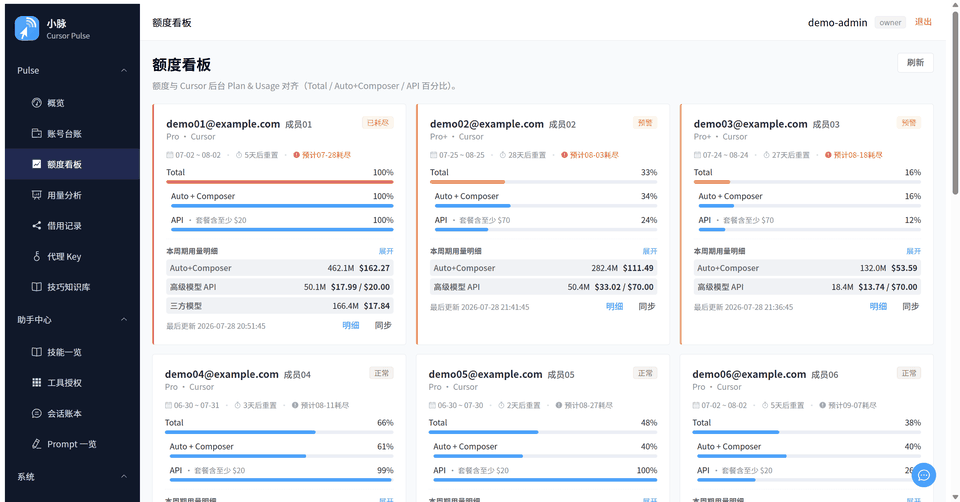
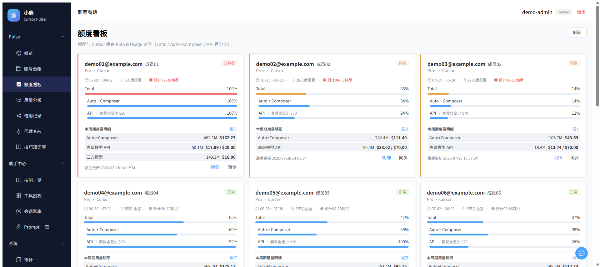
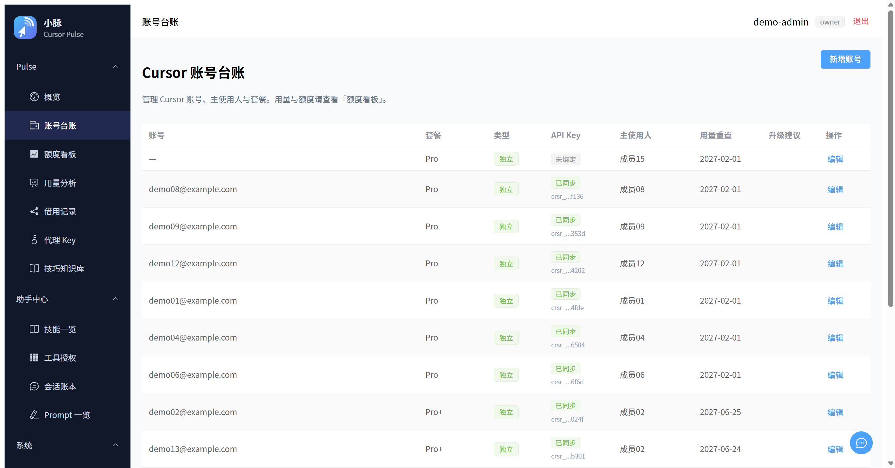
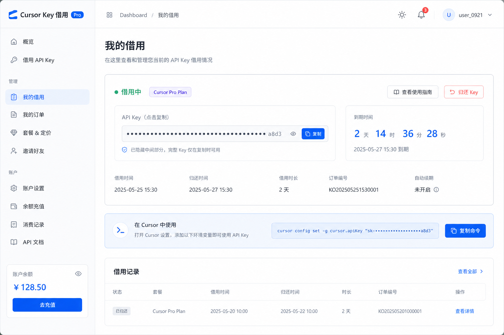

<p align="center">
  <picture>
    <source media="(prefers-color-scheme: dark)" srcset="docs/assets/brand/logo-horizontal-dark.svg" />
    <source media="(prefers-color-scheme: light)" srcset="docs/assets/brand/logo-horizontal.svg" />
    
  </picture>
</p>

# Cursor Pulse

[](LICENSE)
[](https://www.python.org/)
[](docker/)
[](https://github.com/cnwinds/cursor-pulse/releases)
[](https://github.com/cnwinds/cursor-pulse/stargazers)

**Self-hosted Cursor usage metering and quota control plane** — account registry, API key sync, key lending, quota dashboards, and an optional MITM proxy. The core stack is Web + database only; **DingTalk / Feishu and other IM channels are optional plugins** (they do not collect usage themselves).

> **License:** [MIT](LICENSE) · **Notice:** [NOTICE](NOTICE) · **Security:** [SECURITY.md](SECURITY.md) · **Contributing:** [CONTRIBUTING.md](CONTRIBUTING.md) · **中文：** [README_CN.md](README_CN.md)

## Quick preview

Sign in → register an account & bind a key → dashboard fills in → lend a key (~20s; UI previews below — your deployed instance may differ slightly):

<!-- Inline demo: a bare user-attachments URL renders as GitHub's native
     player (big centered play button, plays in place). Hosted on GitHub's
     CDN, not in the git repo. Source: promotion/video/ (1080p master,
     720p web version). -->
https://github.com/user-attachments/assets/4c70dbc3-ee81-4e36-bee9-9845ba6321d4

<details>
  <summary>No video? GIF version</summary>
  <p align="center">
    
  </p>
</details>

<table>
  <tr>
    <td align="center" width="33%">
      <a href="docs/assets/readme/quota-board.png">
        
      </a><br />
      <sub><b>Quota board</b> — aligned with Cursor Plan &amp; Usage</sub>
    </td>
    <td align="center" width="33%">
      <a href="docs/assets/readme/accounts-bind-key.png">
        
      </a><br />
      <sub><b>Accounts</b> — bind Cursor User API keys</sub>
    </td>
    <td align="center" width="33%">
      <a href="docs/assets/readme/key-loan.png">
        
      </a><br />
      <sub><b>Key loans</b> — self-service or admin-assigned</sub>
    </td>
  </tr>
</table>

## Who it's for / who it's not for

### Good fit

- **Small teams / studios** with multiple Cursor accounts who need centralized quota visibility and attribution
- Teams **comfortable self-hosting** (your server, your data — not a third-party SaaS)
- Workflows that need **temporary key lending** with automatic expiry and recall
- Optional **MITM proxy** use cases: transparent rotation and usage attribution (accept CA and compliance trade-offs)
- Ops-minded teams already used to `.env`, backups, and optional IM integrations

### Not a good fit

- **Solo developers with one Cursor account** — the official Cursor dashboard is enough
- Teams **unwilling to run infrastructure** — requires Docker or long-lived Python processes plus sync jobs
- Environments that **forbid MITM** — the proxy needs a trusted custom CA; read [proxy/README.md](proxy/README.md) first
- Production that **depends on undocumented Cursor APIs** — sync may break after Cursor updates ([notes](docs/cursor-usage-api.md))
- A replacement for **Cursor account provisioning at scale** — this is metering and lending, not an account reseller

Being upfront about boundaries tends to build more trust than overselling.

## Components

| Layer | Role |
|-------|------|
| **Pulse** (`pulse/`) | Control plane: registry, Cursor API sync, key loans, Web API, optional IM |
| **Assistant** (`assistant_platform/`) | Optional: sessions, capabilities, memory |
| **Admin UI** (`web-admin/`) | Vue portal (Vite in dev; served by Pulse web in production) |
| **Proxy** (`proxy/`) | Optional: Go HTTPS MITM, intercepts Cursor traffic and reports usage |

Usage data comes from **bound Cursor User API keys → scheduled sync**.

## Which setup should I use?

| Mode | For whom | Notes |
|------|----------|-------|
| **Docker (production)** | Long-running self-host without local Python/Node | One `compose` command; config under `docker/` |
| **Local development** | Contributors, tests, PRs | venv + helper scripts; Vite HMR for the admin UI |

Just want to try it? → **Docker**. Want to hack on the code? → **Local dev**.

---

## 1. Docker (production)

Requirements: Docker + Compose plugin, Linux host (or Docker Desktop).

```bash
git clone https://github.com/cnwinds/cursor-pulse.git
cd cursor-pulse/docker
chmod +x scripts/*.sh
./scripts/setup.sh          # writes .env, config.yaml, random secrets, ADMIN_PASSWORD
```

Review and **back up** at least these in `docker/.env`:

```env
BOT_PLATFORM=none
ADMIN_PASSWORD=<generated by setup>
JWT_SECRET=<generated>
PULSE_CREDENTIAL_ENCRYPTION_KEY=<generated>
```

Web-only is enough to start; add IM later ([docs/RUNBOOK.md](docs/RUNBOOK.md)).

```bash
docker compose up -d --build
```

- Admin UI: `http://<host>:8080/admin/`
- Login: user `admin`, password from `ADMIN_PASSWORD`
- Health: `curl -s http://127.0.0.1:8080/health`

Default stack: `init-db` + `web` + `channel` (sync + loan expiry). Full stack with Assistant: `docker compose --profile full up -d --build`. Backups, Postgres, Nginx, proxy: [docs/RUNBOOK.md](docs/RUNBOOK.md).

---

## 2. Local development

Requirements: Python ≥ 3.11; Node 20+ when editing the admin UI.

```bash
python -m venv .venv
# Windows: .venv\Scripts\activate
# macOS/Linux: source .venv/bin/activate
pip install -e ".[dev,web]"

cp config.example.yaml config.yaml
cp .env.example .env
```

Minimum `.env` (use strong secrets even in dev):

```env
BOT_PLATFORM=none
ADMIN_PASSWORD=<your password>
JWT_SECRET=<high-entropy string, ≥32 bytes recommended>
PULSE_CREDENTIAL_ENCRYPTION_KEY=<high-entropy string>
```

```bash
pulse init-db
pulse admin bootstrap --user-id admin --name "Admin" --password '<same as ADMIN_PASSWORD>' --channel web

# Windows
.\cursor-pulse.bat start web admin
# macOS/Linux
./cursor-pulse.sh start web admin
```

- API: `http://127.0.0.1:8080`
- Admin UI (Vite): `http://127.0.0.1:5173`
- Login: `admin` + `ADMIN_PASSWORD`

Usage sync and loan expiry need `pulse channel` — run it in another terminal, or `./cursor-pulse.sh start` for the full set. Tests: `pytest --tb=short -q` (parallel: `pytest -n auto --tb=short -q`).

Optional IM: `pip install -e ".[dingtalk]"` or `".[feishu]"`, set `BOT_PLATFORM` accordingly.

---

## 3. First-run tutorial

After the stack is up, bind one Cursor key and confirm data appears.

1. **Sign in** — Docker: `http://<host>:8080/admin/` · Dev: `http://127.0.0.1:5173` · `admin` + `ADMIN_PASSWORD`
2. **Create users** (optional) — **Users & permissions → Create user**
3. **Register a Cursor account** — assign an owner, bind a **Cursor User API Key** from account settings
4. **Wait for sync** — `channel` must be running (default in Docker). Check **Quota board** after a cycle; if empty see [docs/RUNBOOK.md](docs/RUNBOOK.md)
5. **Lend keys** (optional) — members use **My loans**; admins use **Loan records**

---

## Documentation

| Doc | Topic |
|-----|--------|
| [README_CN.md](README_CN.md) | 中文 README |
| [docs/RUNBOOK.md](docs/RUNBOOK.md) | Ops: Docker, backups, IM, upgrades, troubleshooting |
| [docs/ARCHITECTURE.md](docs/ARCHITECTURE.md) | Processes and API surfaces |
| [docs/bot-commands.md](docs/bot-commands.md) | Optional IM bot commands |
| [docs/PROXY_LAYERS.md](docs/PROXY_LAYERS.md) | Three different “proxy” concepts |
| [CHANGELOG.md](CHANGELOG.md) | Release history |
| [ROADMAP.md](ROADMAP.md) | Public roadmap |
| [docs/cursor-usage-api.md](docs/cursor-usage-api.md) | Unofficial Cursor API notes |
| [proxy/README.md](proxy/README.md) | MITM proxy (CA / compliance) |
| [CONTRIBUTING.md](CONTRIBUTING.md) | Contributing and test gates |
| [SECURITY.md](SECURITY.md) | Security reporting |

## Risks

The MITM proxy and unofficial Cursor APIs carry compliance and breakage risk. Evaluate before production use — [SECURITY.md](SECURITY.md), [proxy/README.md](proxy/README.md).

Cursor Pulse is released for legitimate, internal metering of your **own** team's Cursor usage. Reselling Cursor accounts, subscriptions, API keys, or quota — or operating any paid account-sharing service built on this project — is expressly prohibited, and operators bear all legal responsibility for their own deployments. See [NOTICE](NOTICE).

---

## Star History

<a href="https://star-history.com/#cnwinds/cursor-pulse&Date">
  <picture>
    <source media="(prefers-color-scheme: dark)" srcset="https://api.star-history.com/svg?repos=cnwinds/cursor-pulse&type=Date&theme=dark" />
    <source media="(prefers-color-scheme: light)" srcset="https://api.star-history.com/svg?repos=cnwinds/cursor-pulse&type=Date" />
    
  </picture>
</a>
