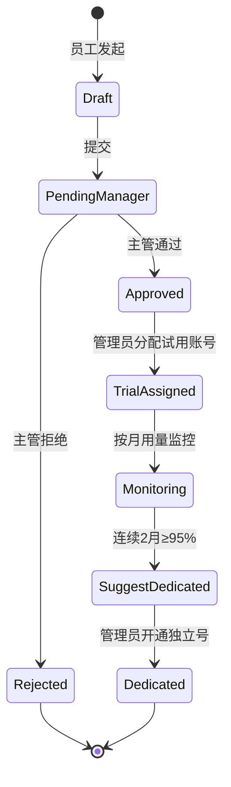

# Pulse AI 工具管理中心 — PRD v2

> **版本**：v2.0  
> **日期**：2026-07-01  
> **状态**：已定稿（需求阶段）  
> **项目代号**：cursor-pulse（代码库名不变，产品定位升级）  
> **群平台**：钉钉（已确认）  
> **替代**：`docs/PRD.md`（v0.4 Cursor 专用版）；v2 为全新需求基线，**不保证与 v0.4 数据模型兼容**

---

## 1. 执行摘要

Pulse 从「团队 Cursor 用量收集」升级为 **AI 工具管理中心**，面向约 **15 人** 规模的研发团队，统一管理多家 AI 开发工具的 **账号台账、用量统计、申请审批、知识沉淀**。

支持工具（可扩展）：**Cursor、智谱、MiniMax、Codex** 等；各厂家套餐通过 **可配置元数据** 维护，不做硬编码。

核心闭环：

1. **台账**：账号、套餐、主使用人、共同使用人、续费日
2. **用量**：主使用人按月提交（共享账号不重复催办）；自动计算额度使用率
3. **流程**：Pulse 内申请 → 主管审批 → 试用池分配 → 连续 2 月 ≥95% 建议独立账号
4. **触达**：详数 Web；主管/管理员钉钉私聊简报；群内 **匿名** 聚合激励
5. **知识**：心得经 AI 整理入库，月度精选发群

设计铁律（继承 v0.4）：

- **计算交给代码，理解交给 AI** — 统计数字由确定性聚合产生，LLM 只叙述与整理，不编造数字
- **各厂家原始货币统计，不做跨币种折算**

---

## 2. 背景与问题

### 2.1 现状

- 公司已采购多种 AI 开发工具，账号分散在个人或共享池中
- 无统一台账，离职回收困难
- 每月用量靠人工收集，共享账号存在重复上报
- 管理层缺少可信的趋势与成本视图
- 使用技巧散落在聊天中，未沉淀

### 2.2 目标

| 目标 | 衡量 |
|------|------|
| 账号可追溯 | 100% 在册账号有主使用人或管理员待办 |
| 用量可审计 | 每条汇总可下钻原始 CSV/截图 |
| 共享不重复劳动 | 每账号每月至多 1 次有效提交 |
| 试用可分流 | 连续 2 月 ≥95% 自动触发升级建议 |
| 群聊激励不伤人 | 群内零个人排名、零个人花费 |

### 2.3 规模与约束

| 项 | 值 |
|----|-----|
| 当前用户 | ~15 人 |
| 年增长 | 个位数 |
| 试用池 | 3 × Cursor Pro+（$60/月，含约 **$70** API 额度池） |
| 组织数据 | 钉钉通讯录同步（部门、主管） |
| 审批 | Pulse 内部，不对接钉钉 OA |
| 迁移 | 可全新重写数据模型，不兼容 v0.4 |

---

## 3. 角色与权限

| 角色 | 职责 |
|------|------|
| **成员** | 作为主使用人提交负责账号的用量；提交使用心得；发起工具申请 |
| **主管** | 审批下属申请；接收升级建议私聊简报 |
| **管理员** | 台账 CRUD、指定/变更主使用人、试用池分配、离职回收、套餐元数据、门户用户 |
| **Owner** | 管理员超集 + 系统配置 |
| **Bot（小脉）** | 催办、接收提交、私聊简报、群匿名 digest、知识整理 |

主管关系来自钉钉通讯录 `manager_userid`，本地缓存于 `members.manager_dingtalk_user_id`。

---

## 4. 核心概念

### 4.1 工具厂商（Vendor）

一家 AI 服务提供方，如 Cursor、智谱（zhipu）、MiniMax、Codex。

### 4.2 套餐计划（Plan）

某厂商下的可订阅/可购买档位，含计费类型、价格、额度、限制。支持 **版本化**（厂家涨价时新建 plan 记录，历史账号保留旧 plan_id）。

### 4.3 账号（Account）

公司或个人持有的工具登录身份（邮箱、API 别名等），绑定一个 plan，有一个 **主使用人** 和若干 **共同使用人**。

### 4.4 主使用人（Primary User）

- 该账号用量提交的 **唯一责任人**
- 共享场景下，共同使用人 **不被催办**
- 无主使用人 → 催办对象改为 **管理员**
- 变更主使用人：**管理员 Web 直接修改**，写入审计日志，无需审批

### 4.5 额度使用比例（Quota Usage Ratio）

```
quota_usage_ratio = primary_metric_value / quota_denominator × 100%
```

- `quota_denominator` 来自 plan 的 `included_quota`（如 Cursor Pro+ 为 **$70**，非月费 $60）
- 仅当 `plan.quota_ratio_enabled = true` 时计算
- 各厂家 **原始货币**，不折算
- 共享账号在 **账号维度** 算比例，不按人拆分

### 4.6 用量汇总（Usage Summary）

**账号 + 自然月** 唯一一行，关联一次 submission（原始文件归档）。

---

## 5. 计费类型抽象

管理员新增套餐时选择 `billing_type`，决定额度字段与是否算比例。

| billing_type | 说明 | 主指标 | 默认算比例 |
|--------------|------|--------|-----------|
| `fixed_monthly_pool` | 月费含固定金额额度池 | `spend` + currency | ✅ |
| `subscription_quota` | 订阅配额（prompts/次数/token） | 按 plan 配置 | 可选 |
| `rolling_window` | 滚动时间窗（如 Codex 5h） | messages/tasks | ❌（展示绝对值） |
| `paygo_api` | 按量 API | spend 或 tokens | 用 `monthly_budget_cap` |
| `hybrid` | 订阅 + 超额按量 | 多指标 | 按 plan 配置 |

### 5.1 预置套餐模板（可导入后修改）

#### Cursor（USD）

| plan_name | 月费 | quota_denominator | 备注 |
|-----------|------|-------------------|------|
| Pro | $20 | $20 API 池 | |
| Pro+ | $60 | **$70** API 池 | 试用池默认档位 |
| Ultra | $200 | $400 API 池 | |
| Teams Standard | $40/人 | 按官方 | 后续扩展 |

#### 智谱（CNY）

| plan_name | 月费 | 主指标 | 算比例 |
|-----------|------|--------|--------|
| GLM Coding Lite | ¥49 | prompts / MCP 次数 | 可选估算 |
| GLM Coding Pro | ¥149+ | prompts | 可选 |
| API PayGo | 按量 | spend_cny | 用预算上限 |

#### MiniMax（USD）

| plan_name | 月费 | 主指标 | 算比例 |
|-----------|------|--------|--------|
| Token Plan Plus | $20 | ~34k calls/月 | 可选 |
| Token Plan Max | $50 | ~102k calls/月 | 可选 |
| PayGo | 按量 | spend_usd | 用预算上限 |

#### Codex / ChatGPT（USD）

| plan_name | 月费 | 主指标 | 算比例 |
|-----------|------|--------|--------|
| Plus | $20 | 5h 滚动消息窗 | ❌ |
| Pro 5x | $100 | 5× Plus 窗口 | ❌ |
| API Key | 按量 | credits/tokens | 用预算上限 |

---

## 6. 功能需求

### 6.1 账号台账

**字段（逻辑模型）**：

| 字段 | 来源 | 说明 |
|------|------|------|
| 员工姓名 | 钉钉通讯录 | 通过 member 关联 |
| 部门 | 钉钉通讯录 | `members.department_name` |
| 直属主管 | 钉钉通讯录 | `members.manager_member_id` |
| 工具账号标识 | 手工 | 邮箱或别名 |
| 购买版本 | plan_id | |
| 开始日期 | 手工 | |
| 续费日期 | 手工 | 到期前 N 天提醒（可配置） |
| 月度预算上限 | 可选 | 覆盖 plan 默认，用于 paygo |
| 账号状态 | 枚举 | `trial` / `shared` / `dedicated` / `suspended` / `available` / `retired` |
| 主使用人 | member_id | 可空 → 管理员待办 |
| 共同使用人 | member_id[] | 仅展示与备注 |
| 共享说明 | 文本 | 如「与李四、王五共同使用」 |
| 归属 | 枚举 | `company` / `personal` |

**试用池初始数据**：

- 3 个 Cursor Pro+ 账号（$60/月，额度分母 $70）
- 状态 `shared` / `trial`
- 管理员维护主使用人

### 6.2 用量统计

**维度**：`account_id` + `period`（YYYY-MM）

| 字段 | 说明 |
|------|------|
| submitted_by_member_id | 提交人（应为主使用人） |
| primary_metric_value | 当月主指标值 |
| primary_metric_unit | usd / cny / prompts / calls / tokens |
| quota_usage_ratio | 可空；Pro+ 例：66.5/70=95% |
| shared_note | 共同使用说明 |
| breakdown_by_model | JSON，模型族聚合 |
| submission_id | 关联原始文件 |

**提交方式**（按工具配置）：

- Cursor：**User API Key 自动同步**（绑定后每日拉取，无需 CSV/截图）
- 其他工具：截图 / 手工录入 / CSV（非 Cursor 厂商）

**渠道**：钉钉私聊（绑定 Key / 手工提交）、群内 @机器人、Web 台账

### 6.3 催办逻辑

```
FOR each active account IN period:
  IF primary_member_id IS NULL:
    NOTIFY admin "账号 {email} 未指定主使用人，请指派"
  ELIF account 本月无有效 submission:
    NOTIFY primary_member 私聊催办
  ELSE:
    SKIP
```

- 共同使用人不催
- 截止日群提醒仅说「还有 N 个账号待上报」，不点名个人

### 6.4 升级建议规则

```
WHEN plan.billing_type = fixed_monthly_pool
 AND quota_usage_ratio >= 95%
 FOR 连续 2 个自然月（同一 account_id）
THEN:
  SET account.suggest_dedicated = true
  NOTIFY 主管 + 管理员（钉钉私聊）
  展示 Pulse 内「申请独立账号」入口
```

独立账号目标：公司注册 **Cursor Pro $20**（便于离职回收），由管理员开通后更新台账。

### 6.5 新申请流程（Pulse 内部）



### 6.6 离职与账号回收

管理员操作：

1. 成员标记离职 / 停用
2. 解绑其主使用人/共同使用人关系
3. 账号状态 → `available`
4. 可重新分配给新申请人
5. 全程 `admin_audit_logs`

### 6.7 使用心得与知识库

**采集**：私聊机器人 / Web 表单 / 群内 @机器人

**AI 整理**（LLM）：

- 提取标题、标签、关联工具、场景、技巧要点
- 去重相似条目
- **不修改用量数字**

**存储**：`knowledge_entries`（支持全文检索 + embedding）

**发布**：

- Web 浏览全库
- 每月 AI 精选 3 条发群（无个人用量信息）

### 6.8 报告与触达

| 受众 | 渠道 | 内容 |
|------|------|------|
| 管理员/主管 | 钉钉私聊 | 分工具分币种简报、待办、升级建议 |
| 全员群 | 钉钉群 | **匿名** digest（见 6.9） |
| 管理层 | Web | 明细、趋势图、台账、导出 |

**不做**：跨币种合计「团队总成本」。

### 6.9 群内匿名激励指标（允许）

- 本月账号上报完成度：`12/15 账号已上报`
- 按 **模型族** 聚合占比：Claude / GPT / Gemini / GLM / MiniMax / Other
- 分工具环比：`Cursor（USD）整体花费环比 +8%`
- 共享试用池平均额度使用率（匿名）
- 本月知识精选摘要

**禁止**：

- 个人花费排名
- 个人额度使用率
- 未提交人姓名点名

### 6.10 钉钉通讯录同步

定时或按需同步：

- `department_name`
- `manager_dingtalk_user_id` → 解析为 `manager_member_id`
- 成员入职自动创建 `members` 行；离职标记 `status=inactive`

---

## 7. 数据模型（DDL 草案）

> 实现时置于 `pulse/storage/models_v2.py` 或迁移脚本；与 v0.4 表 **不兼容**。

### 7.1 ai_vendors

```sql
CREATE TABLE ai_vendors (
  id            TEXT PRIMARY KEY,
  slug          TEXT NOT NULL UNIQUE,  -- cursor, zhipu, minimax, codex
  name          TEXT NOT NULL,
  website       TEXT,
  is_active     INTEGER NOT NULL DEFAULT 1,
  created_at    TEXT NOT NULL
);
```

### 7.2 ai_plans

```sql
CREATE TABLE ai_plans (
  id                      TEXT PRIMARY KEY,
  vendor_id               TEXT NOT NULL REFERENCES ai_vendors(id),
  plan_name               TEXT NOT NULL,
  slug                    TEXT NOT NULL,
  billing_type            TEXT NOT NULL,
  price_amount            REAL NOT NULL,
  price_currency          TEXT NOT NULL,  -- USD, CNY
  billing_cycle           TEXT NOT NULL DEFAULT 'monthly',
  included_quota          TEXT NOT NULL,  -- JSON
  quota_ratio_enabled     INTEGER NOT NULL DEFAULT 0,
  quota_denominator       REAL,             -- 如 Pro+ = 70
  upgrade_threshold_pct   REAL DEFAULT 95,
  upgrade_consecutive_months INTEGER DEFAULT 2,
  usage_submit_methods    TEXT NOT NULL,  -- JSON array
  official_url              TEXT,
  effective_from          TEXT,
  superseded_by_plan_id   TEXT,
  created_at              TEXT NOT NULL,
  UNIQUE(vendor_id, slug, effective_from)
);
```

### 7.3 members（扩展）

在现有 `members` 上增加：

```sql
ALTER TABLE members ADD COLUMN department_name TEXT;
ALTER TABLE members ADD COLUMN manager_dingtalk_user_id TEXT;
ALTER TABLE members ADD COLUMN manager_member_id TEXT REFERENCES members(id);
ALTER TABLE members ADD COLUMN employment_status TEXT DEFAULT 'active'; -- active, inactive
```

### 7.4 ai_accounts

```sql
CREATE TABLE ai_accounts (
  id                    TEXT PRIMARY KEY,
  team_id               TEXT REFERENCES teams(id),
  vendor_id             TEXT NOT NULL REFERENCES ai_vendors(id),
  plan_id               TEXT NOT NULL REFERENCES ai_plans(id),
  account_identifier    TEXT NOT NULL,     -- 邮箱等
  ownership             TEXT NOT NULL DEFAULT 'company',
  status                TEXT NOT NULL DEFAULT 'shared',
  primary_member_id     TEXT REFERENCES members(id),
  shared_note           TEXT,
  monthly_budget_cap    REAL,
  budget_currency       TEXT,
  started_on            TEXT,              -- DATE
  renews_on             TEXT,
  suggest_dedicated     INTEGER DEFAULT 0,
  created_at            TEXT NOT NULL,
  updated_at            TEXT NOT NULL
);

CREATE TABLE ai_account_members (
  account_id   TEXT NOT NULL REFERENCES ai_accounts(id),
  member_id    TEXT NOT NULL REFERENCES members(id),
  role         TEXT NOT NULL DEFAULT 'secondary', -- secondary
  PRIMARY KEY (account_id, member_id)
);
```

### 7.5 submissions（扩展）

```sql
ALTER TABLE submissions ADD COLUMN account_id TEXT REFERENCES ai_accounts(id);
ALTER TABLE submissions ADD COLUMN vendor_id TEXT REFERENCES ai_vendors(id);
```

### 7.6 usage_summaries

```sql
CREATE TABLE usage_summaries (
  id                      TEXT PRIMARY KEY,
  account_id              TEXT NOT NULL REFERENCES ai_accounts(id),
  period                  TEXT NOT NULL,       -- YYYY-MM
  submission_id           TEXT REFERENCES submissions(id),
  submitted_by_member_id  TEXT REFERENCES members(id),
  primary_metric_value    REAL NOT NULL,
  primary_metric_unit     TEXT NOT NULL,
  quota_usage_ratio       REAL,
  shared_note             TEXT,
  breakdown_by_model      TEXT,                -- JSON
  computed_at             TEXT NOT NULL,
  UNIQUE(account_id, period)
);
```

### 7.7 access_requests

```sql
CREATE TABLE access_requests (
  id                  TEXT PRIMARY KEY,
  applicant_member_id TEXT NOT NULL REFERENCES members(id),
  vendor_id           TEXT NOT NULL REFERENCES ai_vendors(id),
  reason              TEXT,
  status              TEXT NOT NULL,  -- draft, pending_manager, approved, rejected, trial_assigned, closed
  manager_member_id   TEXT REFERENCES members(id),
  decided_at          TEXT,
  assigned_account_id TEXT REFERENCES ai_accounts(id),
  created_at          TEXT NOT NULL
);
```

### 7.8 knowledge_entries

```sql
CREATE TABLE knowledge_entries (
  id              TEXT PRIMARY KEY,
  author_member_id TEXT REFERENCES members(id),
  vendor_id       TEXT REFERENCES ai_vendors(id),
  period          TEXT,
  title           TEXT NOT NULL,
  body            TEXT NOT NULL,
  tags            TEXT,              -- JSON array
  source_channel  TEXT NOT NULL,     -- dingtalk_dm, dingtalk_group, web
  status          TEXT DEFAULT 'published', -- draft, published, hidden
  created_at      TEXT NOT NULL
);
```

---

## 8. Web Admin 页面清单

| 路由 | 页面 | 权限 |
|------|------|------|
| `/dashboard` | 总览（分工具卡片、待办） | metrics:read |
| `/accounts` | 账号台账 CRUD、主使用人 | accounts:write |
| `/vendors` | 厂商与套餐元数据 | settings:write |
| `/usage` | 用量汇总、下钻 submission | submissions:read |
| `/requests` | 申请审批 | accounts:write |
| `/knowledge` | 知识库浏览/置顶/隐藏 | knowledge:read |
| `/members` | 成员（含钉钉同步） | members:read |
| `/reports` | 月报、趋势、导出 | metrics:read |
| `/settings` | 收集周期、提醒、群 ID | settings:write |

新增能力码：`accounts:read/write`、`knowledge:read/write`、`requests:read/write`

---

## 9. API 端点（草案）

| Method | Path | 说明 |
|--------|------|------|
| GET | `/api/v2/vendors` | 厂商列表 |
| POST | `/api/v2/vendors` | 新增厂商 |
| GET | `/api/v2/plans?vendor_id=` | 套餐列表 |
| POST | `/api/v2/plans` | 新增套餐 |
| GET | `/api/v2/accounts` | 台账列表 |
| POST | `/api/v2/accounts` | 创建账号 |
| PATCH | `/api/v2/accounts/{id}` | 更新含主使用人 |
| GET | `/api/v2/usage-summaries?period=` | 用量汇总 |
| POST | `/api/v2/submissions` | Web 提交 |
| GET | `/api/v2/access-requests` | 申请列表 |
| POST | `/api/v2/access-requests` | 发起申请 |
| POST | `/api/v2/access-requests/{id}/approve` | 主管审批 |
| GET | `/api/v2/knowledge` | 知识库 |
| POST | `/api/v2/knowledge` | 新增条目 |
| POST | `/api/v2/sync/dingtalk-directory` | 触发通讯录同步 |
| GET | `/api/v2/reports/{period}` | 月报 JSON |
| POST | `/api/v2/reports/{period}/publish-digest` | 发群匿名 digest |

---

## 10. 钉钉 Bot 交互（草案）

| 意图 | 示例 | 行为 |
|------|------|------|
| 提交用量 | 发送 CSV 文件 | 识别主使用人负责账号 → 入库 → 私聊确认 |
| 提交心得 | 「本月技巧：…」 | AI 整理 → 知识库 |
| 查进度 | 「我的账号提交了吗」 | 主使用人维度回复 |
| 管理 | 「谁还没报」 | 管理员：缺报账号列表，不暴露群内 |
| 申请 | 「申请 Cursor」 | 创建 access_request |

---

## 11. 非功能需求

| 类别 | 要求 |
|------|------|
| 可复现性 | 相同输入 + `computation_version` → 相同聚合结果 |
| 可审计性 | 原始文件保留 ≥ 12 个月；主使用人变更全审计 |
| 隐私 | 群内仅匿名聚合；个人明细仅 Web + 私聊 |
| 规模 | 15 人、<50 账号，SQLite 足够 |
| 迁移 | 提供 `pulse db migrate-v2` 或 `init-v2` 清库重建 |

---

## 12. 实施分期

| 阶段 | 交付 | 说明 |
|------|------|------|
| **P0** | 数据模型 v2 + 台账 + 主使用人 + 催办改造 | 账号维度提交 |
| **P1** | 多工具套餐元数据 + 额度比例 + 升级建议 | 含 Pro+ $70 分母 |
| **P2** | 申请审批 + 试用池 + 钉钉通讯录同步 | |
| **P3** | 知识库 + 匿名群 digest + 私聊简报 | |
| **P4** | 智谱/MiniMax/Codex 提交适配 | 可手工录入先行 |

---

## 13. 已确认决策日志

| 日期 | 决策 |
|------|------|
| 2026-07-01 | 多 AI 工具，元数据可配置 |
| 2026-07-01 | 钉钉通讯录同步部门/主管 |
| 2026-07-01 | 各厂家原始货币，不统一折算 |
| 2026-07-01 | 共享账号：主使用人唯一提交责任人 |
| 2026-07-01 | 无主使用人 → 催管理员 |
| 2026-07-01 | 试用池：3 × Cursor Pro+ $60，额度分母 **$70** |
| 2026-07-01 | 升级：连续 2 月额度使用率 **≥95%** |
| 2026-07-01 | 主使用人变更：管理员直接改 + 审计 |
| 2026-07-01 | 群报：匿名模型聚合 + 环比，无个人排名 |
| 2026-07-01 | 不兼容 v0.4，可全新重写 |

---

## 14. 附录：Pro+ 额度比例示例

```
账号：cursor-shared-01@company.com
套餐：Cursor Pro+（quota_denominator = 70 USD）
2026-05 用量：$68.50 → 比例 97.9% → 计入第 1 月达标
2026-06 用量：$67.20 → 比例 96.0% → 计入第 2 月达标
→ 触发 suggest_dedicated，建议为主使用人申请独立 Pro 账号
```

---

## 15. 相关文档

- 旧版（已 superseded）：[PRD v0.4](./PRD.md)
- 运维：[RUNBOOK](./RUNBOOK.md)
- 实现计划：[2026-07-01 实现计划](./plans/2026-07-01-ai-tool-center-v2.md)
