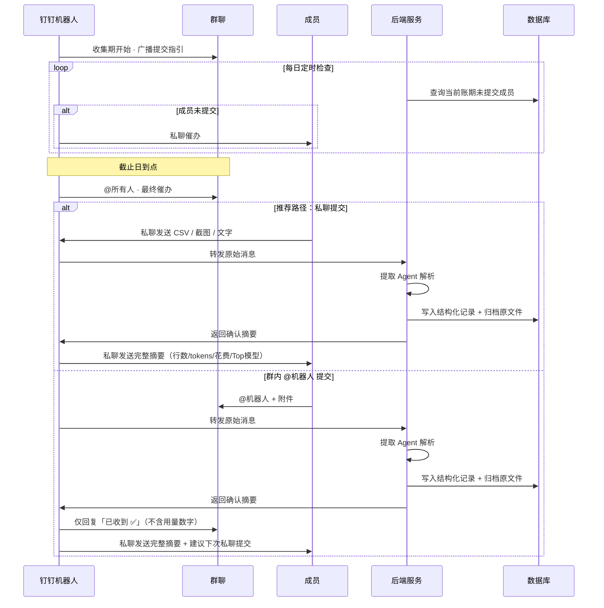
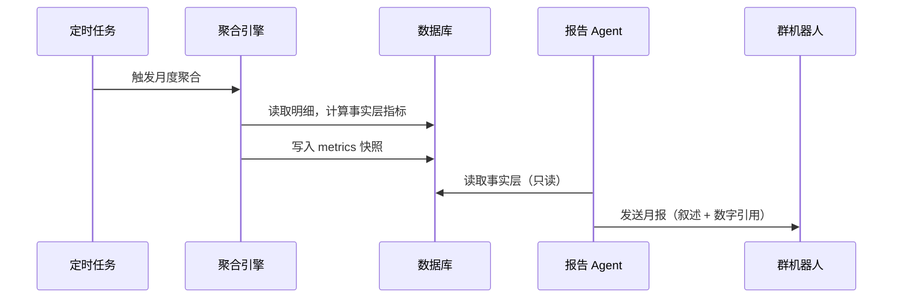
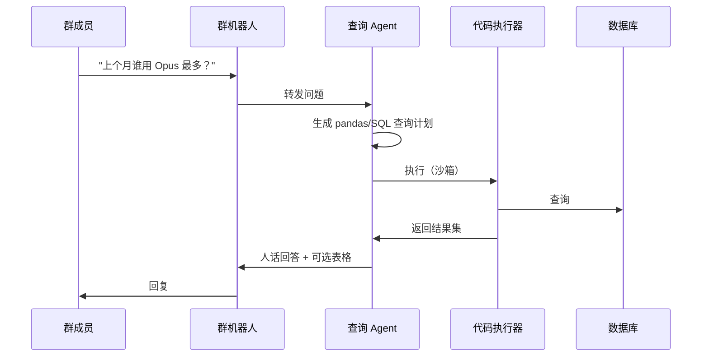

# Cursor Pulse — 团队 Cursor 用量收集与洞察 PRD

> **版本**：v0.4  
> **日期**：2026-06-26  
> **状态**：**已定稿**  
> **项目代号**：cursor-pulse  
> **群平台**：钉钉（已确认）

---

## 1. 执行摘要

Cursor Pulse 是一套面向**使用个人版（Pro/Hobby）Cursor 账号、但希望以团队视角管理 AI 用量**的组织工具。由于 Cursor 不存在团队层级的统一用量接口，每个人的用量数据只能从各自设置页导出 CSV，数据天然散落在成员手中。

本产品**不建设独立上传平台**，而是在现有 AI 使用交流群中部署**钉钉机器人**：到点提醒、接收任意格式的原始输入（CSV / 截图 / 粘贴文字），经提取后存入可审计的结构化表，由**确定性代码**完成聚合计算，由 **LLM** 生成报告叙述与自然语言查询回答。

成员可通过**私聊机器人**（推荐）或在**群内 @机器人**提交文件；机器人每日检查缺报并私聊催办，截止日到点则在群内 @所有人。

核心设计铁律：**计算交给代码，理解交给 AI**——与 ACT 数据分析 agent 的原则一致，LLM 负责解读数字，永远不生成数字。

---

## 2. 问题陈述

### 2.1 谁有这个问题？

| 角色 | 描述 |
|------|------|
| **团队负责人 / 管理者** | 需要掌握团队整体 Cursor 花费、人均用量、异常用户，做预算与规范 |
| **普通成员** | 有个人用量数据，但缺乏动力和规范去主动上报 |
| **数据/运营支持** | 需要可复现、可审计的数字，而非"模型估出来的排名" |

### 2.2 问题是什么？

1. **数据源分散**：Pro/Hobby 用户每人可从 Cursor 设置页（Dashboard → Usage）按日期范围导出 CSV，记录每次请求的日期、模型、花费等；但**没有组织级 API** 统一拉取。
2. **收集摩擦大**：若要求成员登录独立平台、按固定模板整理数据，参与率会快速衰减。
3. **分析不可信**：若把多人 CSV 直接丢给 LLM 做汇总排名，数字不可复现、不可审计，一旦群里质疑无法对账。

### 2.3 为什么痛？

- **管理盲区**：不知道谁在用、用多少、是否有人切换到更贵模型导致成本飙升。
- **组织行为难维持**：没有低摩擦的收集机制，"每月上报"会变成空喊口号。
- **信任危机**：AI 生成的"谁用得最多"若无法追溯到原始记录，结论没有说服力。

### 2.4 已确认的关键约束

| 约束 | 说明 |
|------|------|
| 个人版可导出 CSV | Settings / Dashboard → Usage → 选日期 → Export CSV |
| 无团队统一接口 | Pro/Hobby 场景下不存在 Admin API；Teams/Enterprise 有 API 但不在本 PRD 首要范围 |
| 数据存在但散落 | 问题不是"没有数据"，而是"数据在每个人手里" |
| CSV 与 UI 可能有差异 | 社区反馈 Dashboard、CSV、API 之间费用汇总可能存在细微差异；系统应**保留原始输入**并标注数据来源 |

---

## 3. 目标用户与角色

### 3.1 主要角色

**成员（Contributor）**
- **推荐**私聊钉钉机器人提交 CSV / 截图 / 文字（数据不暴露在群里）
- 也可在群内 @机器人 提交（机器人正常处理，并提示下次可私聊）
- 需要即时确认"传对了没有"
- 缺报时会收到机器人私聊催办

**管理员（Admin）**
- 配置收集周期、截止日、每日检查时间
- 查看/导出团队月报与底层明细
- 处理重复提交、纠错、成员映射

**Bot（系统角色）**
- 收集期开始时群内广播指引
- 每日定时检查缺报 → 私聊催办
- 截止日到点 → 群内 @所有人
- 接收文件、即时确认、生成月报、回答查询

### 3.2 Jobs-to-be-Done

| 角色 | JTBD |
|------|------|
| 成员 | "我想用最少步骤把本月用量交给团队，并立刻知道有没有传对" |
| 成员 | "我希望私聊提交，不在群里暴露个人用量细节" |
| 管理员 | "我想看到可信的团队用量排名和趋势，并能随时对账原始数据" |
| 管理员 | "我想用一句话问'上个月谁 Opus 用得最多'，拿到基于真实数据的答案" |

---

## 4. 设计原则（不可妥协）

### 4.1 铁律：计算 vs 理解

```
┌─────────────────────────────────────────────────────────────┐
│  确定性代码（pandas / SQL）          │  LLM                │
├──────────────────────────────────────┼─────────────────────┤
│  汇总、排名、环比、百分位、模型分布   │  理解杂乱输入         │
│  人均、总花费、趋势                   │  生成报告叙述         │
│  text-to-SQL / text-to-pandas 执行   │  回答自然语言提问     │
├──────────────────────────────────────┴─────────────────────┤
│  特性：可复现、可审计、可导出对账     │  特性：不生成数字     │
└─────────────────────────────────────────────────────────────┘
```

**禁止行为**：
- LLM 直接估算"谁用得最多"或任何统计数字
- 报告叙述中出现未在事实层数据表中存在的数字
- 聚合逻辑依赖模型推理

**允许行为**：
- LLM 读取已算好的 JSON/表格，生成自然语言总结与异常提醒
- LLM 将截图/非结构化文字提取为结构化记录（提取层）
- LLM 将自然语言问题转为查询计划，由代码执行后返回结果

### 4.2 产品原则：系统适配人，而非人适配系统

- 不要求统一上传格式
- 不建设独立 Web 上传平台（MVP 阶段）
- 机器人在成员已有的协作场景（群聊）中完成闭环
- **隐私优先**：群内 @机器人 提交时，群里仅回复「已收到」，详细摘要一律私聊发送

### 4.3 可审计性

- 每条结构化记录必须关联：原始输入、提取时间、提取方式、置信度
- 所有报表数字必须能下钻到明细行
- 保留原始 CSV/图片文件供事后核对

---

## 5. 方案概览

### 5.1 整体架构

```
原始输入（CSV / 截图 / 粘贴文字）
        │
        ▼
┌───────────────────┐
│  提取 Agent        │  ← LLM / Vision：杂乱输入 → 结构化记录
└─────────┬─────────┘
          │
          ▼
┌───────────────────┐
│  结构化存储         │  ← SQLite（MVP）/ Postgres（后续）
│  + 原始文件归档     │
└─────────┬─────────┘
          │
          ▼
┌───────────────────┐
│  聚合引擎           │  ← 纯代码：定时 / 按需跑 pandas/SQL
│  （事实层）         │
└─────────┬─────────┘
          │
    ┌─────┴─────┐
    ▼           ▼
┌─────────┐ ┌─────────┐
│报告 Agent│ │查询 Agent│  ← LLM：事实层 → 人话；问题 → 代码 → 人话
└────┬────┘ └────┬────┘
     │           │
     └─────┬─────┘
           ▼
      群消息 / 管理员通知
```

### 5.2 核心用户流程

#### 流程 A：月度收集（主流程）



#### 流程 B：月报生成



#### 流程 C：即席查询



---

## 6. 数据模型

### 6.1 输入来源说明

**个人版 CSV（主要来源）**  
路径：Cursor Dashboard → Usage → 选择日期范围 → Export CSV  
文件名通常为 `usage-events.csv` 或 `*-usage-events.csv`。

**已验证样本**：历史 Cursor Dashboard CSV 样本已移除（Cursor 改走 API 同步）；解析器仍支持同列结构的非 Cursor / 手工 CSV，测试使用 `tests/fixtures/mini_usage_events.csv`。

| CSV 列名 | 映射字段 | 说明 |
|----------|----------|------|
| `Date` | `event_at` | ISO 8601 时间戳，如 `2026-06-17T07:10:03.037Z` |
| `Cloud Agent ID` | `cloud_agent_id` | 可为空 |
| `Automation ID` | `automation_id` | 可为空 |
| `Kind` | `kind` | 枚举：`Included` / `User API Key` / `Aborted, Not Charged` / `Errored, No Charge` 等 |
| `Model` | `model` | 如 `auto`、`composer-2.5`、`Premium (Codex 5.3)`、`GLM-5.1` |
| `Max Mode` | `max_mode` | `Yes` / `No` |
| `Input (w/ Cache Write)` | `tokens_input_cache_write` | 整数 |
| `Input (w/o Cache Write)` | `tokens_input_no_cache` | 整数 |
| `Cache Read` | `tokens_cache_read` | 整数 |
| `Output Tokens` | `tokens_output` | 整数 |
| `Total Tokens` | `tokens_total` | 整数 |
| `Cost` | `cost_raw` + `cost_usd` | 见下方解析规则 |

**Cost 列解析规则**（确定性代码，不用 LLM）：

| `Cost` 原值 | `cost_raw` | `cost_usd` | 是否计入付费汇总 |
|-------------|------------|------------|------------------|
| `Included` | `included` | `0` | 否（计入请求数 / token 统计） |
| `Free` | `free` | `0` | 否 |
| `-` | `none` | `0` | 否（Aborted/Errored 类记录） |
| `0.00` 等数字 | `usage_based` | 数值 | **是** |

**样本分布**（供测试基准）：
- Kind：`Included` 377 / `User API Key` 93 / `Errored, No Charge` 24 / `Aborted, Not Charged` 4
- Cost：`Included` 375 / `0.00` 94 / `-` 22 / `Free` 7
- 主要 Model：`auto`(165)、`Premium (Codex 5.3)`(136)、`premium`(71)、`GLM-5.1`(70)

**账期定义（已确认）**：按**自然月**（`YYYY-MM`，时区 `Asia/Shanghai`）统计；以 CSV 内 `Date` 字段校验导出范围是否覆盖目标账期。

**截图**  
Settings 页或 Usage 页的表格截图，经 Vision 模型 OCR + 结构化。

**粘贴文字**  
Usage 页 copy/paste 的文本块，经 LLM 解析。

### 6.2 核心表结构（逻辑模型）

#### `members` — 成员映射

| 字段 | 类型 | 说明 |
|------|------|------|
| id | UUID | 主键 |
| display_name | string | 显示名 |
| dingtalk_user_id | string | 钉钉 userid（唯一标识） |
| dingtalk_union_id | string? | 钉钉 unionId（跨应用） |
| cursor_email | string? | 可选，用于 CSV 内邮箱匹配 |
| status | enum | active / inactive |
| prefer_private_submit | bool | 是否已提示私聊提交（默认 false） |
| created_at | datetime | |

#### `submissions` — 提交批次

| 字段 | 类型 | 说明 |
|------|------|------|
| id | UUID | 主键 |
| member_id | FK | 提交者 |
| billing_period | string | 如 `2026-06`（由内容推断或管理员指定） |
| input_type | enum | csv / screenshot / text |
| submit_channel | enum | private / group | 私聊 or 群内 @机器人 |
| raw_file_path | string? | 原始文件存储路径 |
| raw_text | text? | 粘贴文字原文 |
| status | enum | pending / extracted / confirmed / failed |
| submitted_at | datetime | |
| confirmed_at | datetime? | 用户确认时间 |

#### `usage_records` — 用量明细（事实层基础）

| 字段 | 类型 | 说明 |
|------|------|------|
| id | UUID | 主键 |
| submission_id | FK | 来源批次 |
| member_id | FK | 归属成员 |
| event_at | datetime | 请求时间（UTC，保留原始时区信息） |
| event_date | date | 请求日期（由 event_at 派生，便于聚合） |
| kind | string | Included / User API Key / … |
| model | string | 如 auto, composer-2.5, GLM-5.1 |
| max_mode | bool | Max Mode Yes/No |
| tokens_input_cache_write | int | |
| tokens_input_no_cache | int | |
| tokens_cache_read | int | |
| tokens_output | int | |
| tokens_total | int | |
| cost_raw | enum | included / free / none / usage_based |
| cost_usd | decimal | 美元；Included/Free/- 记为 0 |
| cloud_agent_id | string? | |
| automation_id | string? | |
| source_row_hash | string | 原始行哈希，用于去重 |
| extraction_confidence | float | CSV 规则解析默认 1.0 |
| created_at | datetime | |

**去重规则**：同一 `member_id + event_date + model + cost_usd + source_row_hash` 视为重复。同一账期重复提交时，**以最新 submission 覆盖**（已确认，不可累加）。

#### `metric_snapshots` — 聚合快照（事实层输出）

| 字段 | 类型 | 说明 |
|------|------|------|
| id | UUID | |
| period | string | `2026-06` |
| snapshot_type | enum | monthly / weekly / custom |
| metrics_json | JSON | 见 6.3 |
| computed_at | datetime | |
| computation_version | string | 聚合逻辑版本号，保证可复现 |

#### `reports` — 报告记录

| 字段 | 类型 | 说明 |
|------|------|------|
| id | UUID | |
| period | string | |
| snapshot_id | FK | 引用事实层快照 |
| narrative | text | LLM 生成的叙述 |
| posted_at | datetime? | 发到群里的时间 |

#### `query_logs` — 查询审计

| 字段 | 类型 | 说明 |
|------|------|------|
| id | UUID | |
| member_id | FK | 提问者 |
| question | text | 原始问题 |
| query_plan | text | 生成的 SQL/pandas 代码 |
| result_summary | JSON | 代码执行结果 |
| answer | text | 最终人话回答 |
| created_at | datetime | |

### 6.3 事实层指标清单（聚合引擎输出）

以下指标**必须由代码计算**，作为报告 Agent 和查询 Agent 的唯一数字来源：

| 指标 | 说明 |
|------|------|
| `total_cost_usd` | 团队总付费花费（仅 `cost_raw=usage_based`） |
| `total_events` | 团队总事件行数（= 请求次数） |
| `total_tokens` | 团队总 token 数 |
| `member_count_reported` | 已上报人数 |
| `member_count_expected` | 预期人数 |
| `cost_per_member_usd` | 人均付费花费 |
| `events_per_member` | 人均请求数 |
| `tokens_per_member` | 人均 token 数 |
| `cost_by_member[]` | 每人付费花费 + 排名 |
| `events_by_member[]` | 每人请求数 + 排名 |
| `tokens_by_member[]` | 每人 token 数 + 排名 |
| `events_by_model[]` | 各模型请求数占比 |
| `tokens_by_model[]` | 各模型 token 占比 |
| `cost_by_model[]` | 各模型付费花费占比 |
| `kind_distribution[]` | Included / User API Key 等占比 |
| `mom_cost_change_pct` | 付费花费环比 % |
| `mom_events_change_pct` | 请求数环比 % |
| `zero_usage_members[]` | 账期内零事件成员 |
| `unsubmitted_members[]` | 截止日仍未提交成员 |

---

## 7. 功能需求

### 7.1 模块划分

| 模块 | 代号 | AI 参与 | MVP |
|------|------|---------|-----|
| 群机器人网关 | `bot-gateway` | 否 | ✅ |
| 输入提取 | `extract-agent` | 是 | ✅ |
| 结构化存储 | `storage` | 否 | ✅ |
| 聚合引擎 | `aggregator` | 否 | ✅ |
| 报告生成 | `report-agent` | 是 | ✅ |
| 即席查询 | `query-agent` | 是 | ✅（基础） |
| 管理后台 | `admin` | 否 | ⏳ Phase 2 |

### 7.2 Epic 1：钉钉机器人与收集闭环

#### US-1.1 收集期开始 · 群内广播

**作为** 管理员，**我希望** 每个账期开始时机器人在群里发送提交指引，**以便** 全员知道如何操作。

**验收标准**：
- [ ] 支持配置收集开始日（如每月 1 日 09:00）
- [ ] 群内消息包含：Dashboard 导出步骤、支持格式、**推荐私聊机器人提交**
- [ ] 消息附带机器人名片/二维码，方便成员发起私聊
- [ ] 管理员可手动触发：`/remind start`

#### US-1.2 每日缺报检查 · 私聊催办

**作为** 系统，**我希望** 每天定时检查当前账期提交状态，**以便** 对未提交成员一对一催办。

**验收标准**：
- [ ] 支持配置每日检查时间（如 10:00，cron：`0 10 * * *`）
- [ ] 仅在该账期**收集窗口内**执行（开始日 ~ 截止日之间）
- [ ] 查询 `members.status=active` 且当前账期无有效 `submission` 的成员
- [ ] 对每个缺报成员发送**钉钉单聊消息**（非群消息），内容含导出步骤链接
- [ ] 同一成员同一账期每天最多催办 1 次（防骚扰）
- [ ] 已提交成员不收到催办
- [ ] 催办记录写入 `reminder_logs` 表（member_id, period, type=daily_dm, sent_at）

#### US-1.3 截止日 · 群内 @所有人

**作为** 管理员，**我希望** 提交截止日到点时机器人在群里 @所有人 最终催办，**以便** 形成截止压力。

**验收标准**：
- [ ] 支持配置截止日时间（如每月 3 日 18:00）
- [ ] 群内发送 @所有人 消息（需钉钉机器人开通相应权限）
- [ ] 消息包含：截止说明、已提交/未提交人数统计、未提交名单（仅姓名，不含用量细节）
- [ ] 截止日后不再发送每日私聊催办
- [ ] 管理员可手动触发：`/remind deadline`

#### US-1.4 双通道文件接收（私聊优先）

**作为** 成员，**我希望** 可以私聊机器人或在群里 @机器人 提交文件，**以便** 按习惯选择提交方式。

**验收标准**：
- [ ] **私聊通道（推荐）**：成员向机器人单聊发送 CSV / 图片 / 文字，提取完成后**私聊回复完整确认摘要**
- [ ] **群聊通道（隐私优先）**：成员在群内 @机器人 并附文件/文字，机器人：
  - **群内**仅回复：`@{name} 已收到 ✅，详细结果已私聊发你`（**禁止**在群内出现行数、tokens、花费、模型等任何用量数字）
  - **私聊**发送完整确认摘要（同 US-1.6）+ 提示：`建议下次直接私聊我提交`
- [ ] 群聊通道提取失败时：群内仅回复 `@{name} 处理失败，请查看私聊`，错误详情私聊发送
- [ ] 同一用户两种通道共用同一套提取与入库逻辑
- [ ] `submissions.submit_channel` 正确记录 `private` / `group`
- [ ] 消息发送者 `dingtalk_user_id` 自动关联或创建 `members` 记录

#### US-1.5 多格式输入

**作为** 成员，**我希望** 提交 CSV 文件、截图或粘贴文字均可被识别，**以便** 无需整理格式。

**验收标准**：
- [ ] 支持：`.csv` 文件、图片（png/jpg/webp）、纯文本消息
- [ ] 单条消息可含多个文件（合并为一次 submission）
- [ ] 非支持格式时回复友好错误提示
- [ ] 钉钉媒体文件通过开放平台 API 下载后处理

#### US-1.6 即时确认回执

**作为** 成员，**我希望** 提交后立即收到识别摘要，**以便** 确认数据是否正确。

**验收标准**：
- [ ] 提取完成后 30 秒内（P95）回复确认消息
- [ ] **完整摘要**（私聊通道 → 私聊回复；群聊通道 → **仅私聊发送**，见 US-1.4）包含：
  - 识别账期
  - 事件行数
  - Total Tokens 合计
  - 付费花费合计（$Y；若为 0 则说明"均为 Included/Free"）
  - Top 3 模型（按事件数）
- [ ] 若 CSV 日期范围与目标账期不重叠，在私聊摘要中警告"日期范围可能有误"
- [ ] 提取失败时：私聊说明原因并给出 retry 指引；群聊通道额外在群内发极简失败提示（不含错误细节）

#### US-1.7 成员身份映射

**作为** 管理员，**我希望** 将钉钉用户与成员档案关联，**以便** 统计和催办准确。

**验收标准**：
- [ ] 首次提交时以钉钉昵称自动创建 `members` 记录
- [ ] 管理员命令：`/bind @用户 显示名` 或 `/bind userid 显示名`
- [ ] 成员名单：**管理员手动 `/members add`** 维护 active 名单；首次提交自动创建记录但不自动加入催办名单（已确认）
- [ ] 同一账期重复提交：**覆盖**（最新 submission 为准，已确认）

### 7.3 Epic 2：提取 Agent

#### US-2.1 CSV 解析（usage-events 格式）

**作为** 系统，**我希望** 确定性解析 Cursor `usage-events.csv`，**以便** 高置信度、零 LLM 成本处理主路径。

**验收标准**：
- [ ] 精确匹配 6.1 节列名；表头变体（大小写、空格）容错
- [ ] 正确解析 `Cost` 四类值（Included / Free / - / 数字）
- [ ] 正确解析 `Date` ISO 8601 为 UTC datetime
- [ ] 每条记录写入 `source_row_hash`（基于原始行内容）
- [ ] 单元测试以迷你 fixture（`tests/fixtures/mini_usage_events.csv`）覆盖解析与聚合主路径
- [ ] 解析失败时降级 LLM 辅助（截图/非标准 CSV 路径）

#### US-2.2 截图提取

**作为** 成员，**我希望** 发送 Usage 页截图也能被识别，**以便** 懒得导出 CSV 时也能上报。

**验收标准**：
- [ ] Vision 模型提取：日期、模型、花费、请求数（若有）
- [ ] 输出 `extraction_confidence` 分数
- [ ] 截图模糊/不完整时明确告知缺失字段
- [ ] 原始图片归档至对象存储/本地目录

#### US-2.3 文字粘贴解析

**作为** 成员，**我希望** 从 Usage 页复制的文本块能被解析，**以便** 快速上报。

**验收标准**：
- [ ] LLM 结构化提取，输出与 CSV 路径相同的 `usage_records`  schema
- [ ] 解析结果展示前 3 行样例供用户目视确认

### 7.4 Epic 3：聚合引擎（纯代码）

#### US-3.1 月度聚合

**作为** 管理员，**我希望** 每月自动生成团队用量事实层快照，**以便** 报告和查询有可信数据源。

**验收标准**：
- [ ] 按 `billing_period` 聚合所有 `usage_records`
- [ ] 输出 6.3 节全部指标至 `metric_snapshots`
- [ ] 聚合逻辑版本号写入 `computation_version`
- [ ] 同一 period 重复跑聚合，结果 bit-identical（可复现）
- [ ] 提供 CLI：`python -m pulse aggregate --period 2026-06`

#### US-3.2 环比计算

**作为** 管理员，**我希望** 自动计算环比变化，**以便** 发现用量异常趋势。

**验收标准**：
- [ ] 对比当前 period 与上一 period 的 `total_cost`、`total_requests`
- [ ] 上一 period 无数据时，环比字段为 `null` 而非错误

#### US-3.3 数据导出

**作为** 管理员，**我希望** 导出底层明细和聚合结果，**以便** 与 Cursor 官方数据对账。

**验收标准**：
- [ ] 导出 CSV：某 period 全部 `usage_records`
- [ ] 导出 JSON：`metric_snapshots.metrics_json`
- [ ] CLI：`python -m pulse export --period 2026-06 --format csv`

### 7.5 Epic 4：报告 Agent

#### US-4.1 月度群报告

**作为** 管理员，**我希望** 每月在群里自动发布团队用量报告，**以便** 全员透明了解使用情况。

**验收标准**：
- [ ] 报告 Agent **只读取** `metric_snapshots`，不读取原始明细
- [ ] 报告结构：总览数字 → 排名 → 模型分布 → 环比 → 洞察叙述
- [ ] 洞察叙述示例："本月整体用量环比上升 35%，主要增量来自 3 人切换到更贵模型；XX 本月零用量，建议确认"
- [ ] 报告中每个数字可追溯到 snapshot JSON 中的 key
- [ ] Prompt 约束：禁止生成 snapshot 中不存在的数字
- [ ] **全群可见**（已确认）：报告发至群内，仅含团队汇总与个人排名，不含事件级明细

#### US-4.2 缺报公示

**作为** 管理员，**我希望** 报告和截止催办中列出未提交成员，**以便** 定向跟进。

**验收标准**：
- [ ] 对比 `members.status=active` 与当前账期有效 submission
- [ ] 月报中列出 `unsubmitted_members[]`
- [ ] 与 US-1.2 / US-1.3 催办逻辑共用同一缺报检测函数

### 7.6 Epic 5：查询 Agent

#### US-5.1 自然语言即席查询

**作为** 群成员，**我希望** 在群里用自然语言提问用量问题，**以便** 无需查表或写 SQL。

**验收标准**：
- [ ] 支持问题类型：排名、过滤（按模型/日期/成员）、聚合（sum/count/avg）
- [ ] 查询 Agent 生成 pandas/SQL → 沙箱执行 → 返回结果
- [ ] **禁止** LLM 直接回答数字；必须经代码执行
- [ ] 回答附简短说明查询范围（如"基于 2026-05 已上报数据"）
- [ ] 每次查询写入 `query_logs` 审计

#### US-5.2 查询安全边界

**作为** 系统，**我希望** 限制查询 Agent 的执行范围，**以便** 防止注入或越权。

**验收标准**：
- [ ] 只允许 SELECT / pandas read 操作
- [ ] 查询超时 10 秒
- [ ] 结果行数上限 500
- [ ] 非管理员**仅可查询聚合/排名**（已确认），不可查看他人事件级明细

### 7.7 Epic 6：管理命令（MVP 轻量版）

通过钉钉私聊或群内 @机器人 发送命令，无需 Web 后台。

| 命令 | 功能 | 权限 | 回复渠道 |
|------|------|------|----------|
| `状态` / `/status` | 查看当前账期提交进度 | 所有人 | 同通道 |
| `我的` / `/my` | 查看本人已提交摘要 | 所有人 | 私聊优先 |
| `报告 [账期]` / `/report` | 手动触发月报 | Admin | 群内 |
| `聚合 [账期]` / `/aggregate` | 手动触发聚合 | Admin | 私聊确认 |
| `绑定` / `/bind` | 成员身份管理 | Admin | 私聊 |
| `成员` / `/members` | 列出成员及提交状态 | Admin | 私聊 |
| `导出 [账期]` / `/export` | 返回明细 CSV 文件 | Admin | 私聊 |
| `催办 开始` / `/remind start` | 手动发收集期广播 | Admin | 群内 |
| `催办 截止` / `/remind deadline` | 手动发截止 @所有人 | Admin | 群内 |

---

## 8. 非功能需求

| 类别 | 要求 |
|------|------|
| **可复现性** | 给定相同输入数据 + `computation_version`，聚合结果必须一致 |
| **可审计性** | 原始文件保留 ≥ 12 个月；query_logs 全量保留 |
| **响应时间** | CSV 提取确认 P95 < 30s；截图 P95 < 60s |
| **可用性** | MVP 单实例部署，接受计划内重启；消息处理至少一次投递 |
| **安全** | 原始用量数据含敏感信息，存储加密 at-rest（Phase 2）；bot webhook 签名校验 |
| **成本** | 提取/报告/查询调用 LLM 需记录 token 消耗；CSV 主路径优先规则解析降本 |

---

## 9. 技术方案建议（MVP）

### 9.1 推荐技术栈

| 层 | 选型 | 理由 |
|----|------|------|
| 语言 | Python 3.11+ | pandas 生态、与 ACT agent 经验一致 |
| 存储 | SQLite + 本地文件 | MVP 轻量，单人可运维 |
| 任务调度 | APScheduler | 每日缺报检查、截止 @所有人、月报 |
| LLM | 可配置（OpenAI / Anthropic / 本地） | 截图/文字提取、报告、查询 |
| Bot 网关 | **钉钉企业内部应用机器人** | 已确认平台 |
| 部署 | 单机 Docker Compose | 一后端 + Stream 长连接 |

### 9.2 钉钉集成方案

#### 应用类型

钉钉**企业内部应用** + **机器人**，推荐使用 **Stream 模式**（长连接接收事件，无需公网 inbound webhook）。

#### 必要权限与能力

| 能力 | 用途 | 备注 |
|------|------|------|
| 接收消息（群聊） | 群内 @机器人 收文件 | 机器人需加入目标群 |
| 接收消息（单聊） | 成员私聊提交 | 需开通"机器人单聊"能力 |
| 发送群消息 | 广播指引、确认回复、@所有人 | @所有人 需 `atAll` 参数 + 群权限 |
| 发送单聊消息 | 每日催办、私聊确认、群提交后的私聊提示 | 使用 `robot/oToMessages/batchSend` 或单聊 API |
| 下载媒体文件 | 获取用户上传的 CSV/图片 | 消息内 `downloadCode` → 临时 URL |

#### 消息路由逻辑

```
钉钉 Stream 事件
    │
    ├─ conversationType = "1" (单聊) ──→ submit_channel = private
    │
    └─ conversationType = "2" (群聊)
           │
           ├─ 被 @ 且含文件/文字 ──→ 处理提交, submit_channel = group
           ├─ 被 @ 且为管理命令 ──→ 命令处理器
           └─ 未被 @ ──→ 忽略（避免刷屏）
```

#### 配置项（已确认默认值，`config.yaml`）

```yaml
dingtalk:
  app_key: ${DINGTALK_APP_KEY}
  app_secret: ${DINGTALK_APP_SECRET}
  robot_code: ${DINGTALK_ROBOT_CODE}
  group_open_conversation_id: ${DINGTALK_GROUP_ID}  # 目标群

collection:
  period_format: "%Y-%m"           # 账期格式
  start_day: 1                       # 每月 1 日开始收集
  start_time: "09:00"
  deadline_day: 3                    # 每月 3 日截止
  deadline_time: "18:00"
  daily_check_time: "10:00"          # 每日缺报私聊催办
  timezone: "Asia/Shanghai"
```

#### 提醒消息模板

**收集期开始（群内）**：
```
📊 {period} Cursor 用量收集开始

请在 {deadline} 前完成提交：
1. 打开 cursor.com/dashboard → Usage
2. 选择账期日期范围 → Export CSV
3. **私聊本机器人**发送 CSV 文件（推荐，数据不公开）

也可在本群 @我 提交，我会正常处理。
```

**每日私聊催办**：
```
Hi {name}，{period} Cursor 用量还未收到。

导出步骤：Dashboard → Usage → 选日期 → Export CSV
直接发给我就行。
```

**截止 @所有人（群内）**：
```
⏰ {period} 用量提交截止提醒

已提交：{n_submitted}/{n_total} 人
尚未提交：{names}

请尚未提交的同学尽快私聊我发送 CSV。
```

### 9.3 项目结构（建议）

```
cursor-pulse/
├── pulse/
│   ├── bot/
│   │   ├── dingtalk/    # Stream 客户端、消息路由、媒体下载
│   │   ├── reminders/   # 每日检查、截止 @所有人
│   │   └── commands/    # 管理命令
│   ├── extract/       # CSV 解析 + Vision/LLM 提取
│   ├── storage/       # ORM + 文件归档
│   ├── aggregate/     # 纯代码聚合
│   ├── report/        # 报告 Agent
│   ├── query/         # 查询 Agent + 沙箱执行
│   └── cli.py         # 命令行入口
├── tests/
│   └── fixtures/      # 迷你 CSV 等测试夹具
├── docs/
├── docker/            # Dockerfile + compose
├── scripts/           # 运维/辅助脚本
└── pyproject.toml
```

### 9.4 Agent Harness 接口约定

各 Agent 统一输入/输出 JSON schema，便于替换模型与独立测试：

```python
# 提取
ExtractInput(submission_id, raw_content, input_type) → ExtractOutput(records[], confidence, warnings[])

# 报告
ReportInput(snapshot: MetricSnapshot) → ReportOutput(narrative, sections[])

# 查询
QueryInput(question, context: QueryContext) → QueryOutput(query_plan, result, answer)
```

---

## 10. 范围边界

### 10.1 MVP 包含（Phase 1，目标 1–2 天可跑通）

- [x] 钉钉 Stream 机器人（单聊 + 群聊 @机器人）
- [x] 双通道提交，群提交后提示私聊
- [x] 每日缺报私聊催办 + 截止日 @所有人
- [x] `usage-events.csv` 规则解析（含样本测试）
- [x] 截图 + 文字提取（降级路径）
- [x] SQLite 存储 + 本地文件归档
- [x] 聚合引擎 + 月报推送
- [x] 基础 NL 查询
- [x] 钉钉管理命令

### 10.2 MVP 不包含（明确 Out of Scope）

| 项目 | 原因 |
|------|------|
| Web 上传平台 / 登录系统 | 与"机器人进群"设计相悖，增加摩擦 |
| Teams/Enterprise Admin API 直连 | 不同数据源模型，后续独立 Epic |
| 多群 / 多租户 SaaS | MVP 服务单团队即可 |
| 实时用量监控 | 数据本身是月度批量导出 |
| 费用预测 / 预算告警 | 需历史数据积累后再做 |
| 与 Git/Jira 等项目维度关联 | 个人版 CSV 无项目字段 |
| 移动端 App | 群聊即移动端 |
| LLM 直接生成统计数字 | 设计铁律禁止 |

### 10.3 Phase 2 候选

- Web 管理后台（成员管理、数据可视化、审计日志）
- 企业微信 / 飞书 多平台适配
- Postgres + 对象存储
- Teams 计划 Admin API 接入（与 CSV 收集并存）
- 导出 PDF 月报
- 低置信度截图人工确认流

### 10.4 Phase 3 候选

- 多团队 SaaS 化
- 与 FinOps / 内部 BI 对接
- 异常检测（用量突增自动告警）

---

## 11. 成功指标

| 指标 | 定义 | MVP 目标 |
|------|------|----------|
| **收集率** | 当月 active 成员中成功提交占比 | ≥ 80% |
| **提取准确率** | 人工抽检 CSV 提交，记录级字段正确率 | ≥ 99% |
| **确认响应时间** | 提交到 bot 确认 P95 | < 30s |
| **数字可审计率** | 报告/查询中的数字均可追溯到 snapshot 或明细 | 100% |
| **查询有效回答率** | 常见问题类型成功返回代码执行结果 | ≥ 90% |
| **运维负担** | 管理员每月手动干预次数 | < 3 次 |

---

## 12. 风险与缓解

| 风险 | 影响 | 缓解 |
|------|------|------|
| Cursor CSV 格式变更 | 解析失败 | 规则解析 + LLM 降级；样本库持续更新 |
| 截图识别不准 | 错误数据入库 | 置信度阈值 + 人工确认流；保留原图 |
| 群平台 API 限制 | 文件大小/频率 | 私聊提交为主；大文件超限时提示分段 |
| 成员不参与 | 数据不完整 | 每日私聊催办 + 截止 @所有人 + 月报公示缺报名单 |
| LLM 幻觉数字 | 信任崩塌 | 架构强制代码算数；报告 prompt 约束 + 自动化测试 |
| CSV 与 Dashboard 数字不一致 | 对账困难 | 文档说明已知差异；以成员提交的 CSV 为团队内部一致口径 |

---

## 13. 已确认决策

所有原 Open Questions 均已确认，MVP 按以下默认值实施：

| # | 决策项 | 确认值 |
|---|--------|--------|
| OQ-1 | 群平台 | **钉钉**（企业内部应用 + Stream 模式） |
| OQ-2 | 账期定义 | **自然月**（`YYYY-MM`，时区 `Asia/Shanghai`）；CSV 内 Date 校验覆盖范围 |
| OQ-3 | 重复提交策略 | **覆盖**（同一账期以最新 submission 为准） |
| OQ-4 | 报告可见范围 | **全群可见**（团队汇总 + 个人排名，无事件级明细） |
| OQ-5 | 非管理员查询权限 | **仅聚合/排名**，不可查看他人明细行 |
| OQ-6 | 部署环境 | **单机 Docker Compose** |
| OQ-7 | LLM 使用策略 | CSV **规则解析、不走 LLM**；Vision **仅截图路径**；报告/查询 LLM 供应商部署时配置 |
| OQ-8 | 收集窗口 | 每月 **1 日 09:00** 开始 · **3 日 18:00** 截止 · 每日 **10:00** 私聊催办 |
| OQ-9 | 成员名单 | 管理员 **`/members add`** 手动维护；首次提交自动建档但不自动进催办名单 |
| OQ-10 | 群聊确认隐私 | **隐私优先**：群内仅「已收到 ✅」，完整摘要私聊发送 |

> PRD 定稿，可进入实现计划阶段。

---

## 14. 实施阶段建议

### Phase 1 — 最小可用（1–2 天）

```
Day 1 AM  │ 脚手架 + SQLite + usage-events CSV 解析（样本测试）
Day 1 PM  │ 钉钉 Stream 接入 + 私聊/群聊双通道 + 即时确认
Day 2 AM  │ 每日催办 + 截止 @所有人 + 收集期广播
Day 2 PM  │ 聚合引擎 + 报告 Agent + 基础查询 + 端到端联调
```

**Phase 1 完成定义（Definition of Done）**：
1. 成员**私聊**机器人发 CSV，30 秒内收到正确摘要（498 行样本解析正确）
2. 成员**群内 @机器人** 发 CSV：群内仅见「已收到 ✅」；私聊收到完整摘要 +「建议下次私聊」提示
3. 模拟缺报：每日检查任务向未提交者发私聊；截止任务群内 @所有人
4. 管理员触发报告，群内收到含排名和环比的月报
5. 导出明细可与 snapshot 数字对账

### Phase 2 — 完善（+3–5 天）

- 管理命令完善、缺报催办、置信度人工确认流
- 多样本 CSV 测试、聚合单元测试
- 第二种群平台适配（如有需要）

### Phase 3 — 增强（按需）

- Web 管理后台
- Teams API 接入
- 多租户

---

## 15. 附录

### A. Cursor 个人版 CSV 导出操作指引（钉钉 Bot 文案）

**收集期开始（群内广播）**：
```
📊 {period} Cursor 用量收集开始

导出步骤：
1. 打开 https://cursor.com/dashboard
2. Usage → 选择本月日期范围 → Export CSV
3. 私聊本机器人，发送 CSV 文件 ✅ 推荐

也可在本群 @我 发送（群里不会显示你的用量细节，结果私聊发你）。
```

**群聊提交 · 群内极简回复**：
```
@{name} 已收到 ✅，详细结果已私聊发你。
```

**群聊提交 · 私聊完整摘要**：
```
✅ {period} 用量已录入

事件行数：{n_events}
Total Tokens：{total_tokens}
付费花费：${cost}（均为 Included/Free 时说明原因）
Top 模型：{model1} ({n1})、{model2} ({n2})、{model3} ({n3})

小提示：下次可以直接私聊我提交，更方便也更私密。
```

### E. 新增表：`reminder_logs`

| 字段 | 类型 | 说明 |
|------|------|------|
| id | UUID | |
| member_id | FK? | 私聊催办时必填；@所有人 时为空 |
| period | string | 账期 |
| type | enum | `collection_start` / `daily_dm` / `deadline_at_all` |
| sent_at | datetime | |
| dingtalk_msg_id | string? | 钉钉消息 ID，便于排查 |

### B. 报告 Agent Prompt 约束（摘要）

```
你只能使用下方 JSON 中已计算好的数字。
禁止估算、补充或修改任何数值。
若 JSON 中无相关字段，明确说"数据中暂无此项"。
洞察部分仅做语言归纳与提醒，不可引入新数字。
```

### C. 查询 Agent 执行约束（摘要）

```
1. 将问题转为 pandas 代码，仅允许 read/query 操作
2. 代码必须 against 预定义的 usage_records DataFrame
3. 执行结果返回后再生成自然语言回答
4. 禁止在未执行代码的情况下回答任何数字
```

### D. 名词表

| 术语 | 定义 |
|------|------|
| 事实层 | 由确定性代码计算、可复现的指标与明细 |
| 洞察层 | LLM 在事实层之上生成的叙述与提醒 |
| 账期 | 一次用量统计的时间范围，通常按月 |
| 提交 | 成员一次上传行为，可含多个文件 |

---

## 变更记录

| 版本 | 日期 | 作者 | 变更 |
|------|------|------|------|
| v0.1 | 2026-06-26 | — | 初稿，基于设计讨论整理 |
| v0.2 | 2026-06-26 | — | 确认钉钉平台；双通道提交；每日私聊催办 + 截止 @所有人；补充 usage-events.csv 字段映射与样本 |
| v0.3 | 2026-06-26 | — | 确认 OQ-10 隐私优先：群聊仅极简确认，完整摘要私聊发送 |
| v0.4 | 2026-06-26 | — | 全部 OQ 确认：自然月账期及其余默认值；PRD 定稿 |
