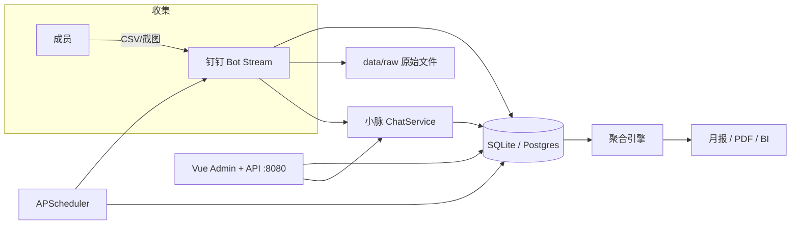

# Cursor Pulse 运维 Runbook

> **受众**：团队管理员、SRE/运维  
> **时区**：`Asia/Shanghai`（与 `config.yaml` → `collection.timezone` 一致）  
> **版本**：对应 cursor-pulse Phase 1–4 全功能

---

## 1. 系统概览

Cursor Pulse 是钉钉 Stream 机器人 + 定时调度 + SQLite/Postgres 的单体服务，负责：

- 收集团队成员 Cursor 用量 CSV（私聊/群 @）
- 确定性聚合 → 月报 → 可选 BI Webhook
- 每日催办、截止提醒、异常告警



### 关键路径

| 组件 | 进程/命令 | 数据 |
|------|-----------|------|
| 机器人 + 调度 | `pulse serve` | 长连接，不可多实例抢同一机器人 |
| 管理后台 API | `pulse web`（可选独立进程） | JWT / 钉钉 OAuth；配置写入 `team_settings` |
| Vue 前端（开发） | `web-admin` → `npm run dev` :5173 | 代理 `/api` 到 8080 |
| Vue 前端（生产） | `npm run build` 后由 `pulse web` 挂载 `/admin/` | 同域静态资源 |
| 数据库 | `data/pulse.db` 或 Postgres | 成员、提交、聚合快照 |
| 原始文件 | `data/raw/` | CSV、截图 inbox |
| 群绑定 | `data/dingtalk_group.json` | 自动捕获 openConversationId |

---

## 2. 部署清单

### 2.1 钉钉开放平台（一次性）

1. 创建**企业内部应用**，启用**机器人**，模式选 **Stream**（非 Webhook）。
2. 开通权限（至少）：
   - 接收群聊/单聊消息
   - 企业内机器人发送消息
   - 媒体文件下载
3. 记录：`AppKey`、`AppSecret`、`robot_code`（机器人 ID）。
4. 将机器人拉入目标群；记录群 `chatId`（可选，展示用）。
5. **openConversationId**：
   - 优先在 `.env` 配置 `DINGTALK_GROUP_ID=cid...==`
   - 或留空，在群内 **@机器人** 一次，自动写入 `data/dingtalk_group.json`

### 2.2 配置文件

```bash
cp config.example.yaml config.yaml
cp .env.example .env
# 编辑 .env，勿提交 Git
```

**生产必填项：**

| 变量 | 说明 |
|------|------|
| `DINGTALK_APP_KEY` / `DINGTALK_APP_SECRET` | 应用凭证 |
| `DINGTALK_ROBOT_CODE` | 机器人 ID |
| `DINGTALK_GROUP_ID` | openConversationId（或首次 @ 自动绑定） |
| `DINGTALK_ADMIN_USER_IDS` | 管理员 userid，逗号分隔；**首次启动会迁移为 `portal_role=owner`** |
| `JWT_SECRET` | Web 登录 JWT 签名（**生产必配**；未配时回退 `ADMIN_WEB_TOKEN`） |
| `ADMIN_WEB_TOKEN` | 机器 API / 灾备 Bearer（与 JWT 并存） |

**Web 登录相关（推荐）：**

| 变量 | 说明 |
|------|------|
| `DINGTALK_OAUTH_REDIRECT_URI` | 钉钉 OAuth 回调，开发默认 `http://localhost:5173/login/callback` |
| `WEB_CORS_ORIGINS` | 逗号分隔 CORS 来源，如 `http://localhost:5173` |

**钉钉开放平台（Web 扫码登录）**：在应用中补充 **重定向 URL**（与 `DINGTALK_OAUTH_REDIRECT_URI` 一致），并开通扫码登录相关 scope。

**推荐生产项：**

| 变量 | 说明 |
|------|------|
| `PULSE_TEAM_SLUG` | 多团队隔离 slug，单团队用 `default` |
| `BI_WEBHOOK_URL` | 月报后自动推送 FinOps/BI |
| `DATABASE_URL` | Postgres 连接串（见 2.4） |

### 2.3 Docker 部署（SQLite，单机）

```bash
docker compose build
docker compose run --rm pulse pulse init-db -c /app/config/config.yaml
docker compose up -d
docker compose logs -f pulse
```

持久化目录：

- `./data` → 数据库 + 原始文件 + 群绑定
- `./config.yaml` → 只读挂载

### 2.4 Docker + Postgres

```bash
# 修改 docker-compose.postgres.yml 中 POSTGRES_PASSWORD，并同步 DATABASE_URL
docker compose -f docker-compose.yml -f docker-compose.postgres.yml up -d
docker compose run --rm pulse pulse init-db -c /app/config/config.yaml
```

连接串示例：

```env
DATABASE_URL=postgresql+psycopg://pulse:<密码>@db:5432/pulse
```

容器内需安装 Postgres 驱动：镜像构建时已包含 `psycopg` 时可直接用；否则在 `Dockerfile` 中 `pip install -e ".[postgres]"`。

### 2.5 裸机部署

```bash
python -m venv .venv
.venv\Scripts\activate          # Windows
# source .venv/bin/activate       # Linux
pip install -e ".[web,pdf,postgres,s3]"   # 按需裁剪

pulse init-db
pulse serve                     # 前台或 systemd/supervisor 守护
# 可选另一终端：
pulse web --port 8080

# 可选：Vue 管理后台（开发）
cd web-admin && npm install && npm run dev   # http://localhost:5173
```

---

## 3. 月度运营日历

默认调度（`config.yaml` → `collection`）：

| 时间 | 自动任务 | 说明 |
|------|----------|------|
| 每月 **1 日 09:00** | 收集开始广播 | 群内发送导出指引 |
| 每月 **1–3 日 每天 10:00** | 缺报私聊催办 | 仅 `active` 且未确认提交成员 |
| 每月 **3 日 18:00** | 截止提醒 | 群内 `【@所有人】` + 未提交名单 |
| 每月 **4 日 11:00** | 月报 + 异常告警 | 聚合 → 发群 → BI Webhook → 管理员私聊告警 |

**账期**：自然月 `YYYY-MM`，时区 `Asia/Shanghai`。

### 3.1 收集开始前（每月末/1 日前）

- [ ] 确认 `pulse serve` 进程健康（见 §6）
- [ ] 在群内 @机器人 发「状态」，确认 active 成员名单正确
- [ ] 新成员：`成员 添加 <userid> <姓名>`（仅 active 会被催办）
- [ ] 确认 `.env` 凭证未过期

### 3.2 收集期中（1–3 日）

- [ ] 每日看「状态」或 Web 后台提交进度
- [ ] 对长期未提交者线下跟进（机器人已私聊催办）
- [ ] 处理 **待审截图**（见 §5.3）

### 3.3 月报日（4 日）

- [ ] 检查群内月报是否正常发布
- [ ] 若有 BI Webhook，确认下游收到 JSON
- [ ] 查看管理员私聊 **异常告警**，按需跟进
- [ ] 可选：`pulse report --period YYYY-MM --pdf reports/YYYY-MM.pdf` 归档 PDF

---

## 4. 日常操作手册

### 4.1 成员管理

| 操作 | 群内命令（管理员） | CLI / 说明 |
|------|-------------------|------------|
| 加入催办名单 | `成员 添加 userid 姓名` | 首次只提交 CSV 不会自动 active |
| 查看名单 | `成员` | Web `/api/members` |
| 移除催办 | `成员 移除 userid` | 设为 inactive |
| 查看进度 | `状态` | Web `/api/periods/{period}/status` |

### 4.2 手动触发调度

```bash
pulse remind start              # 收集开始广播
pulse remind daily              # 立即催办缺报
pulse remind deadline           # 截止提醒
pulse remind report             # 月报 + 告警 + BI
pulse remind report --period 2026-06
```

### 4.3 数据导入与对账

```bash
# 代导入某成员 CSV（测试/补录）
pulse import samples/usage-events-sample.csv --user-id <userid> --name Alice --period 2026-06

# 重新聚合
pulse aggregate --period 2026-06

# 生成月报（不发群）
pulse report --period 2026-06

# 发布月报到群
pulse report --period 2026-06 --publish

# 导出明细对账
pulse export --period 2026-06 -o data/raw/export_2026-06.csv
```

### 4.4 查询与告警

```bash
# 群内自然语言（规则引擎，数字可审计）
查询 谁用得最多

# 手动异常检测
pulse alerts --period 2026-06

# 手动 BI 推送
pulse bi-push --period 2026-06
```

### 4.5 Web 管理后台（小脉）

**首次开通管理员：**

```bash
# 方式 A：CLI 创建 owner（灾备密码登录）
pulse admin bootstrap --user-id <钉钉userid> --name "管理员" --password <强密码>

# 方式 B：.env 中 DINGTALK_ADMIN_USER_IDS 会在 resolve_team 时自动设为 owner

# 授予他人后台角色
pulse admin grant --user-id <userid> --role operator
```

**启动：**

```bash
pip install -e ".[web]"
pulse web                                    # API :8080
cd web-admin && npm run dev                  # 开发 UI :5173（代理 API）

# 生产同域
cd web-admin && npm run build
pulse web                                    # 访问 http://host:8080/admin/
```

**登录方式：**

1. **钉钉扫码**（推荐）：登录页 → 钉钉 OAuth → 回调写入 JWT
2. **密码登录**（灾备）：`dingtalk_user_id` + `pulse admin bootstrap` 时设置的密码
3. **机器 Token**：`Authorization: Bearer <ADMIN_WEB_TOKEN>`（兼容旧面板与脚本）

**与小脉对话执行任务**（须对应 `portal_role` 权限，无按钮、走对话）：

- Web 右下角 **小脉** 浮窗，或 `POST /api/chat`
- 钉钉私聊小脉自然语言（同一 `ChatService` + `AdminToolRouter`）
- 示例：「催一下没交的」「重新聚合 2026-06」「有待审的吗？」

| 能力码 | 对话/工具示例 |
|--------|----------------|
| `tasks:nudge` | 催未提交成员 |
| `metrics:aggregate` | 重新聚合 |
| `reports:publish` | 发群月报（需 `pulse serve` 侧钉钉连接） |
| `submissions:read` | 列出待审 |
| `evolution:run` | 记忆自进化 |

后台页面：概览 · 成员 · 提交 · 指标 · 记忆/原则/披露 · 审计 · 配置 · 系统与集成 · 账号权限。

---

## 5. 特殊流程

### 5.1 群 openConversationId 丢失

**现象**：群消息/月报发送失败，日志 `group_open_conversation_id 未配置`。

**处理**：

1. 在目标群内 @机器人 发任意消息（或 `帮助`）。
2. 检查 `data/dingtalk_group.json` 是否更新。
3. 将 `openConversationId` 写入 `.env` 的 `DINGTALK_GROUP_ID`。
4. 重启 `pulse serve`。

备选（需 `qyapi_chat_read` 权限）：

```bash
pulse dingtalk resolve-group --chat-id <群号>
```

### 5.2 成员重复提交 / 纠错

- **策略**：同一成员同一账期 **以最新提交覆盖**（旧 confirmed 记录会被替换）。
- 成员重新私聊发送 CSV 即可。
- 管理员无需删库；若需代导入用 `pulse import`。

### 5.3 低置信度截图待审

**流程**：

1. Vision 识别置信度 < 阈值 → 状态 `pending_review`，**不计入**统计。
2. 管理员：`待审` 或 Web `GET /api/pending-reviews`。
3. 确认：`确认 <id前8位>` → 计入账期。
4. 拒绝：`拒绝 <id前8位>` → 删除待审数据。

### 5.4 多团队（同一数据库）

- 每个部署实例设置不同 `PULSE_TEAM_SLUG`（如 `team-a`）。
- 数据按 `team_id` 隔离；**不要**两个实例共用同一钉钉机器人 + 同一 slug。

---

## 6. 健康检查

### 6.1 进程

```bash
# Docker
docker compose ps
docker compose logs --tail 100 pulse

# 期望日志
# Reminder scheduler started
# Stream 连接成功（无持续报错）
```

### 6.2 HTTP

```bash
curl -s http://127.0.0.1:8080/health
# {"status":"ok","time":"..."}
```

### 6.3 端到端冒烟

**机器人：**

1. 私聊机器人发送 `帮助` → 有回复。
2. 私聊发送 sample CSV → 30 秒内收到摘要。
3. 管理员 `状态` → 已提交人数 +1。

**Web 后台：**

1. `curl -s http://127.0.0.1:8080/health` → `status: ok`。
2. `pulse admin bootstrap ...` 后，密码登录或钉钉 OAuth → 进入概览。
3. 概览页提交率、系统与集成页调度计划可加载。
4. 小脉浮窗发送「你好」→ 有回复；owner 发送「有待审的吗」→ 返回列表或「无待审」。
5. （可选）`pytest` 全绿：`python -m pytest -q`。

---

## 7. 故障排查

| 现象 | 可能原因 | 处理 |
|------|----------|------|
| 机器人无回复 | Stream 断连、凭证错误 | 重启 `pulse serve`；检查 AppKey/Secret |
| 群消息发不出 | 无 openConversationId | §5.1 |
| 私聊 OTO 失败 | robot_code 错误、权限不足 | 核对 `DINGTALK_ROBOT_CODE` |
| 文件下载失败 | 未开通媒体下载权限 | 开放平台补权限 |
| 催办未收到 | 成员非 `active` | `成员 添加 ...` |
| 月报无数/报错 | 无提交或无 snapshot | `pulse aggregate` 后再 `report` |
| LLM 洞察变规则 | API 失败或数字审计失败 | 查日志 `LLM insights failed`；属安全降级 |
| BI Webhook 失败 | URL/网络/签名 | 查日志 `BI webhook push failed`；手动 `bi-push` |
| Web 401 | Token/JWT 无效或过期 | 重新登录；检查 `JWT_SECRET`；脚本可用 `ADMIN_WEB_TOKEN` |
| Web 403 | 无 `portal_role` | `pulse admin grant` 或 bootstrap |
| 小脉催办无效果 | Web 未连钉钉 | `publish_report`/`nudge` 需 messenger；生产建议 `pulse serve` 同机或配置钉钉凭证 |
| Postgres 连接失败 | DATABASE_URL/密码 | 检查 compose 与健康检查 |

### 7.1 日志位置

- Docker：`docker compose logs pulse`
- 裸机：前台 stderr；建议 systemd `StandardOutput=journal`

### 7.2 数据库损坏（SQLite）

```bash
# 停止服务
cp data/pulse.db data/pulse.db.bak.$(date +%Y%m%d)
pulse init-db   # 仅在新环境；生产用备份恢复
```

---

## 8. 备份与恢复

### 8.1 备份内容

| 路径 | 频率建议 |
|------|----------|
| `data/pulse.db` 或 Postgres volume | 每日 |
| `data/raw/` | 每周（或 S3 归档后本地可缩短） |
| `data/dingtalk_group.json` | 随配置变更 |
| `config.yaml`、`.env`（安全存储） | 变更时 |

### 8.2 SQLite 备份示例

```bash
sqlite3 data/pulse.db ".backup data/backup/pulse-$(date +%Y%m%d).db"
```

### 8.3 Postgres 备份示例

```bash
docker exec cursor-pulse-db pg_dump -U pulse pulse > backup/pulse-$(date +%Y%m%d).sql
```

### 8.4 恢复

1. 停止 `pulse serve`。
2. 还原数据库文件或 `psql` 导入。
3. 确认 `data/raw` 与 DB 记录一致（可选）。
4. 启动服务，执行 §6.3 冒烟。

---

## 9. 升级与回滚

### 9.1 升级

```bash
git pull
docker compose build
docker compose run --rm pulse pulse init-db -c /app/config/config.yaml   # 跑迁移
docker compose up -d
pytest   # 发布前在 staging 执行
```

`init-db` 会执行轻量 schema 迁移（`pulse/storage/migrate.py`），对已有 SQLite 库追加 `team_id` 等列。

### 9.2 回滚

```bash
docker compose down
git checkout <previous-tag>
docker compose build && docker compose up -d
# 若数据库 schema 已升级，需用备份恢复或联系开发
```

---

## 10. 安全

1. **`.env` 不入 Git**；生产用密钥管理（K8s Secret、Vault 等）。
2. **轮换**：钉钉 AppSecret、LLM API Key、`JWT_SECRET`、`ADMIN_WEB_TOKEN`、BI webhook secret 定期更换。
3. **Web 后台**：仅内网或 VPN 暴露；禁止公网裸奔 8080；敏感数据**不脱敏**，靠登录 + 能力码控制。
4. **门户权限**：用 `members.portal_role` 管理后台访问；`DINGTALK_ADMIN_USER_IDS` 仅作首次 owner 迁移。
5. **原始用量数据**：含敏感信息；`data/raw` 与 DB 访问受控；可选 S3 + 桶策略。

---

## 11. 可选能力速查

| 能力 | 启用方式 |
|------|----------|
| LLM 报告洞察 | `LLM_ENABLED=true` + `LLM_API_KEY` |
| 截图 Vision | `VISION_ENABLED=true` + `VISION_MODEL=gpt-4o` |
| PDF 月报 | `pip install -e ".[pdf]"`，`pulse report --pdf` |
| S3 归档 | `S3_ENABLED=true` + endpoint/bucket/keys |
| Postgres | `docker-compose.postgres.yml` + `DATABASE_URL` |
| 飞书/企微 | `BOT_PLATFORM=feishu|wecom`（当前为扩展桩，见 `docs/platforms/`） |

---

## 12. 联系与升级路径

| 级别 | 场景 | 动作 |
|------|------|------|
| L1 | 成员不会导出 CSV | 群内发 PRD 附录操作指引 / 私聊协助 |
| L2 | 机器人无响应、月报未发 | 运维按 §7 排查，手动 `pulse remind` |
| L3 | 数据对账不一致、DB 损坏 | 恢复备份 + 开发支持 |

**相关文档**：

- [PRD](PRD.md)
- [实现计划](plans/2026-06-26-cursor-pulse-mvp.md)
- [Web 后台设计](superpowers/specs/2026-06-27-web-admin-design.md)（已实现）
- [小脉记忆设计](superpowers/specs/2026-06-27-digital-employee-memory-design.md)
- [飞书扩展](platforms/feishu.md) / [企微扩展](platforms/wecom.md)

---

## 附录 A：收集期群内广播模板（参考）

```
📊 {YYYY-MM} Cursor 用量收集开始

导出步骤：
1. 打开 https://cursor.com/dashboard → Usage
2. 选择本月日期范围 → Export CSV
3. 私聊本机器人发送 CSV（推荐）

也可在本群 @我 提交（群里不会显示用量细节）。
```

## 附录 B：systemd 单元示例（Linux）

```ini
[Unit]
Description=Cursor Pulse Bot
After=network.target

[Service]
Type=simple
WorkingDirectory=/opt/cursor-pulse
EnvironmentFile=/opt/cursor-pulse/.env
ExecStart=/opt/cursor-pulse/.venv/bin/pulse serve -c /opt/cursor-pulse/config.yaml
Restart=always
RestartSec=10

[Install]
WantedBy=multi-user.target
```

## 附录 D：Web 后台联调清单

| # | 步骤 | 期望 |
|---|------|------|
| 1 | `pulse init-db` | schema + `pm_*` 记忆表存在 |
| 2 | `pulse admin bootstrap --user-id X --password P` | CLI 输出 Portal owner |
| 3 | `pulse web` + `web-admin npm run dev` | 5173 可打开登录页 |
| 4 | 密码登录 | 跳转概览，侧边栏按权限显示 |
| 5 | 配置页修改 `collection.deadline_day` | 保存成功；`GET /api/settings` 反映变更 |
| 6 | 记忆/原则页 | owner 可查看全文；可新增原则 |
| 7 | 小脉对话「列出待审」 | `actions` 含 `list_pending_reviews` 或口语回复 |
| 8 | 钉钉 OAuth（需开放平台重定向 URL） | 回调后 JWT 登录 |
| 9 | 同一 userid 钉钉私聊小脉 | 与 Web 同一 `member` 记忆连续 |
| 10 | `npm run build` + 仅 `pulse web` | `http://host:8080/admin/` 可访问 |

## 附录 C：CLI 速查

| 命令 | 用途 |
|------|------|
| `pulse init-db` | 初始化/迁移 schema |
| `pulse serve` | Bot + 调度器 |
| `pulse web` | 管理后台 API + 可选 `/admin/` 静态页 |
| `pulse admin bootstrap` | 创建首个 portal owner |
| `pulse admin grant` | 授予 portal 角色 |
| `pulse memory evolve` | 手动记忆自进化 |
| `pulse import/aggregate/report/export` | 数据管线 |
| `pulse remind start\|daily\|deadline\|report` | 手动调度 |
| `pulse alerts --period` | 异常检测 |
| `pulse bi-push --period` | BI 推送 |
| `pulse teams-api --period` | Teams API 桩 |
