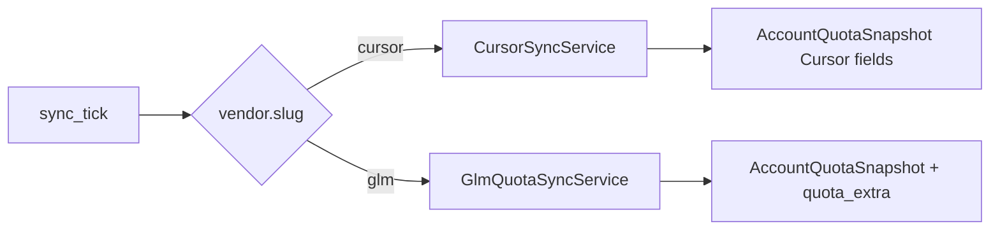

# ADR 0002：GLM（Z.ai / 智谱）账号台账与额度看板

- **状态**：草案（待产品确认）
- **日期**：2026-09-24
- **范围**：Pulse Web 账号台账、额度看板、后台同步；**不包含** MITM 代理、Key 借用、用量事件明细（首期）

## 背景与目标

团队已在 Pulse 中管理 **Cursor** 账号（台账、API Key、周期同步、额度看板）。现需在同一套 **AiAccount / 凭证 / 快照** 模型下，增加 **GLM Coding Plan** 账号（Z.ai 国际站 `api.z.ai` 与国内站 `open.bigmodel.cn`），并在额度看板中展示与 Cursor 卡片同等级的「健康 / 预警 / 耗尽」与重置倒计时。

用户侧已核实的额度来源（非公开文档，但多插件交叉验证）：

```http
GET /api/monitor/usage/quota/limit
Authorization: Bearer <GLM_API_KEY>
```

- 国际：`https://api.z.ai/api/monitor/usage/quota/limit`
- 国内：`https://open.bigmodel.cn/api/monitor/usage/quota/limit`

响应核心字段：`data.level`（lite / pro / max）、`data.limits[]`（`TOKENS_LIMIT` / `TIME_LIMIT`，含 `unit`、`percentage`、`nextResetTime`）。

**明确不在首期范围**：

- 开放平台「按量充值余额」查询（与 Coding Plan 窗口额度是不同计费体系）。
- GLM 用量事件拉取与「用量分析」页对齐（当前无与 Cursor `usage events` 对等的已核实接口）。
- 将 GLM 纳入 Credential Pool / Key Loan / Auto Lender / Jev（仍仅 Cursor）。

## 现状调研摘要

| 层级 | 现状 | 对 GLM 的含义 |
|------|------|----------------|
| 数据模型 | `AiVendor` / `AiPlan` / `AiAccount` / `AiAccountCredential` 已多厂家 | 仅需 seed `glm` 厂家与套餐行 |
| 快照 | `AccountQuotaSnapshot` 为 Cursor 计费周期 + `total/auto/api_pct` + 美分 | 需扩展或旁路存储 GLM 多窗口 limit |
| 同步 | `CursorSyncService` + `sync_tick` 全量走 Cursor API | 需按 `vendor.slug` 分发 |
| 台账 API | 创建账号强制 `crsr_`；凭证 API 写死「仅 Cursor」 | 需 vendor 分支 |
| 额度看板 | `build_quota_board_items(vendor_slug="cursor")` | 需合并或分 tab 展示 GLM |
| 前端 | 页面标题/文案写死 Cursor；`isCursorRow` 控制 Key 列 | 需通用化或分 vendor UI |

## 设计原则

1. **复用台账模型，不 fork 一套 GLM 表**——与 `CONTEXT.md` 中 Member / AiAccount 语义一致。
2. **快照层 vendor 可扩展**——Cursor 字段保持兼容；GLM 专有指标进结构化 JSON，避免为每个厂家加列。
3. **同步与借用解耦**——GLM 首期只做 quota monitor 同步；不接入 Go proxy。
4. **容错优先**——monitor 接口未文档化，解析失败应降级为 `unknown` + 可重试，不拖垮 scheduler。
5. **认证双模式**——先 `Bearer`，401 时自动重试裸 key（与社区报告一致）。

## 数据模型

### 1. 厂家与套餐（seed）

新增 `AiVendor`：

| slug | name | 说明 |
|------|------|------|
| `glm` | GLM / Z.ai | website 指向 Coding Plan 或开放平台文档 |

新增 `AiPlan`（slug 与 API `level` 对齐，可随 API 返回自动校正）：

| slug | plan_name | billing_type | 说明 |
|------|-----------|--------------|------|
| `lite` | Lite | `glm_coding_plan` | 来自 `data.level` |
| `pro` | Pro | `glm_coding_plan` | |
| `max` | Max | `glm_coding_plan` | |

`included_quota` JSON 建议预留：`{"windows": ["5h", "weekly"], "limit_types": ["TOKENS_LIMIT", "TIME_LIMIT"]}`（仅展示/metadata，不参与 Cursor 计价逻辑）。

### 2. 账号扩展字段

在 `AiAccount` 上增加（迁移）：

| 字段 | 类型 | 说明 |
|------|------|------|
| `api_region` | `enum`: `zai` \| `bigmodel` \| `auto` | 默认 `auto`：先 z.ai，401/域名错误再 bigmodel |

`account_identifier`：GLM 无可靠邮箱解析时，允许用户填写备注名或邮箱；绑 Key 时不强制与 JWT 邮箱一致（Cursor 仍保持现有校验）。

### 3. 额度快照扩展

在 `AccountQuotaSnapshot` 增加可空列：

```text
vendor_slug     VARCHAR(16)   -- 冗余便于查询，默认 cursor
quota_extra     JSON          -- vendor 专有
```

**Cursor**：`quota_extra` 为 `null`，继续使用现有列。

**GLM** `quota_extra` 建议结构（版本化）：

```json
{
  "schema_version": 1,
  "level": "pro",
  "limits": [
    {
      "type": "TOKENS_LIMIT",
      "unit": 3,
      "unit_label": "5h",
      "percentage": 3,
      "next_reset_at": "2026-09-24T15:00:00Z"
    },
    {
      "type": "TOKENS_LIMIT",
      "unit": 6,
      "unit_label": "weekly",
      "percentage": 31,
      "next_reset_at": "2026-09-28T00:00:00Z"
    },
    {
      "type": "TIME_LIMIT",
      "unit": 3,
      "unit_label": "5h_mcp",
      "percentage": 10,
      "next_reset_at": "..."
    }
  ],
  "primary_pct": 31,
  "primary_reset_at": "2026-09-28T00:00:00Z"
}
```

**映射到看板「主进度」**（供 `analyze_burn_rate` 复用或 GLM 专用分析器）：

- `total_pct` ← 所有 `TOKENS_LIMIT` 的 **max(percentage)**（最紧窗口决定状态）。
- `cycle_end` / `cycle_end_at` ← **最近**的 `nextResetTime`（展示「即将重置」）。
- `auto_pct` / `api_pct` ← GLM 卡片不使用；前端按 vendor 隐藏 Cursor 三栏，改显 5h / 周 / MCP。

可选：将 `primary_pct` 写入 `total_pct` 列，便于排序与预警阈值复用现有 95% 逻辑。

### 4. 凭证

与 Cursor 相同表 `AiAccountCredential`：

- `credential_type`: `api_key`
- Key 前缀：不强制 `crsr_`；校验为非空、长度合理即可（具体前缀规则确认后写入 API）。
- `sync_enabled`: 默认 true

## 集成层

新增 `pulse/integrations/glm_monitor_api.py`：

- `fetch_quota_limits(api_key, region=auto) -> GlmQuotaDTO`
- HTTP：`httpx` + 现有 `outbound_client` 模式（与 `CursorApiClient` 一致）
- 错误分类：401/auth、404/域名、5xx、JSON 结构漂移 → 接入 `classify_sync_error`

**unit 枚举**（来自社区/插件，需在实现时用常量表 + 未知 unit 告警日志）：

| unit | 含义（约定） |
|------|----------------|
| 3 | 5 小时 token 窗口 |
| 6 | 每周 token 窗口 |
| （TIME_LIMIT 的 unit） | MCP 调用次数窗口（与 token 同 unit 编码，按 type 区分） |

## 同步流水线



`GlmQuotaSyncService.sync_account`：

1. 解密 primary credential。
2. 调 monitor API；成功则解析 `level` → 若与账号 `plan.slug` 不一致，可选：写 audit + 更新 plan（**需确认**：自动改套餐 vs 仅告警）。
3. 写入 snapshot；更新 `usage_resets_on` = 最近 weekly reset 的 date（`resets_on_source=api`）。
4. **不**拉 usage events；`IngestionResult.event_count = 0`。
5. 更新 credential `last_sync_*`；不触发 Key Loan expire（GLM 无借用）。

`sync_tick`：保持现有 credential 查询，仅在 `sync_account` 内部分发（或在 tick 层按 account vendor 选 service）。

配置：可在 `AppConfig` 增加 `glm_sync.enabled`（默认 true），与 `cursor_sync.enabled` 独立。

## API 变更

| 端点 | 变更 |
|------|------|
| `POST /api/v2/accounts` | `vendor_id` 可选；默认 cursor。GLM：校验 key + region；从 monitor 拉 level 填 plan；identifier 可选手填 |
| `GET /api/v2/accounts` | 凭证摘要扩展至 `vendor.slug == glm` |
| 凭证 bind/unbind/sync | 去掉「仅 Cursor」；按 vendor 分发 sync |
| `GET /api/v2/quota/board` | 查询 `cursor` + `glm`（或 query `?vendor=`）；项中增加 `vendor_slug`、`quota_extra` |
| `POST .../sync` | 已有账号同步走分发器 |

Board item 补充字段：

```json
{
  "vendor_slug": "glm",
  "glm_limits": [ ... denormalized for UI ... ],
  "display_mode": "glm_windows"
}
```

## 前端

### 账号台账

- 标题：**AI 账号台账**（或保留副标题说明含 Cursor + GLM）。
- **Tab 或筛选**：全部 / Cursor / GLM（默认全部）。
- 表格增加 **平台** 列（vendor_name）。
- 新建对话框：**平台** → 套餐列表随 vendor 过滤；GLM 增加 **站点**（国际/国内/自动）。
- API Key 校验随 vendor 变化；GLM 展示同步状态同 Cursor。

### 额度看板

- 副标题说明 GLM 对齐 Z.ai monitor 窗口百分比。
- 卡片渲染分支：
  - `vendor_slug === 'cursor'`：现有 Total / Auto / API。
  - `vendor_slug === 'glm'`：进度条 5h Tokens / Weekly Tokens / MCP（无数据则折叠）。
- 排序：仍按 status rank + progress；GLM 用 `total_pct`（max token %）。
- **隐藏** GLM 卡片上的 Jev / Auto Lender 标签（首期）。

## 权限与审计

- 复用 `accounts:read/write`；无新 capability。
- 审计日志：`account.create` / `credential.bind` / `sync` 记录 `vendor_slug`。

## 测试计划

| 类型 | 内容 |
|------|------|
| 单元 | monitor 响应解析（多 limit、缺字段、未知 unit）；region fallback；auth Bearer vs raw |
| 集成 | 创建 GLM 账号 → mock HTTP → snapshot 落库 → board API 形状 |
| 回归 | Cursor 创建/同步/看板无行为变化 |

Fixtures：录制 anonymized JSON 于 `tests/fixtures/glm/quota_limit.json`。

## 迁移与 rollout

1. Alembic：`api_region`、`quota_extra`、`vendor_slug`（snapshot 冗余）。
2. `seed_v2_catalog` 增加 glm vendor/plans（幂等）。
3. 部署后管理员手动建 GLM 账号或后续 bulk import（out of scope）。
4. 文档：`docs/glm-quota-monitor.md` 记录接口来源与风险声明。

## 风险与开放问题（需确认）

1. **套餐自动同步**：API 返回 `level` 与台账 plan 不一致时，是否自动改 plan 并记 history？
2. **账号标识**：GLM key 是否有关联邮箱 API？若无，是否强制用户填 identifier？
3. **Key 格式**：Z.ai / 智谱 key 是否有稳定前缀（用于前端校验）？
4. **看板默认视图**：Cursor + GLM 混排 vs 分 Tab？混排时是否按 vendor 分组？
5. **预警阈值**：GLM 是否沿用 95% warning / 100% exhausted，还是 5h 窗口单独更严？
6. **国内/国际**：同一 key 是否可能两域都有效？`auto` 策略是否足够？
7. **后续阶段**：是否计划 GLM 进入借用池 / 代理（若否，在 CONTEXT 中加一句边界）？

## 建议实施阶段

| 阶段 | 交付 |
|------|------|
| **M1** | 模型 + seed + GLM client + GlmQuotaSyncService + 台账 CRUD + 看板 GLM 卡片 |
| **M2** | scheduler 稳定性、region auto、plan 自动对齐策略、文档 |
| **M3**（可选） | 用量分析、助手技能 `glm.self/quota`、与 Cursor 并列的 bot 指令 |

---

确认以上开放问题后进入 M1 开发。
