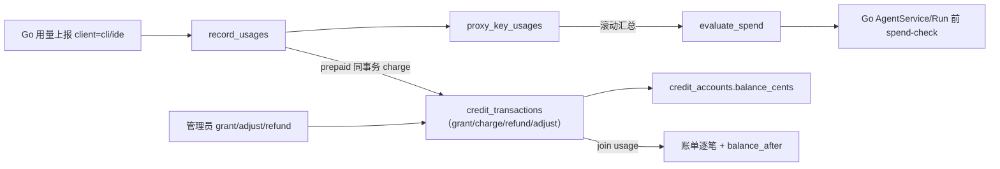

# ADR-0006：成员会员、余额与统一用量规则

- 状态：已实现（2026-10-03）
- 日期：2026-10-03
- 相关：`pulse/proxy/spend_policy.py`、`pulse/proxy/membership.py`、`pulse/proxy/credit.py`、`pulse/proxy/team_membership.py`、`pulse/proxy/usage.py`、`pulse/web/internal_proxy_api.py`、`pulse/web/membership_present.py`、`pulse/storage/migrate.py`、`pulse/storage/models.py`、`proxy/mitm.go`、`proxy/pulse_client.go`、`CONTEXT.md`、`NOTICE`

## 背景

ADR-0004 为单次 `pka_` 借用提供滚动 Auto/API 封顶；`pk_` 另有按 key 的 5h/7d **总费用**窗，在授权或业务请求阶段拦截。成员往往同时拥有 `pk_`、`pka_` 与 `pkide_`（ADR-0005），CLI 与 IDE 用量分散在多把 key 与多笔借用上，管理员需在多处维护限额，且无法统一预付余额。

产品确认：以 **成员（Member）** 为唯一计费与限额主体；窗口规则与余额模式合并为一套引擎；余额无周期、像储值卡；成员可查看逐笔账单；仅作内部预算，不对接支付（见 NOTICE 禁止额度转售）。

## 已审核决策

### 统一用量规则（Spend Rule）

1. **成员范围**：有效会员的窗口统计汇总该成员名下全部 `proxy_key_usages`（`member_id` 相同），覆盖其 `pk_`、`pka_`（`loan_id`）与 `pkide_` 产生的用量。`pkide_` 授权仍解析到父 `proxy_key_id` / `loan_id`，spend-check 与记账沿用父 ID，自然计入同一成员。
2. **周期与桶**：`5h` / `week`（滚动 7 天）/ `month`（滚动 30 天）；桶为 `auto`、`api` 或 **`total`**（auto + api 合计，承接原 `pk_` 总额窗口）。多条规则之间为 **「或」**：请求所属桶内任一规则达到上限即拦截该桶。
3. **分桶**：沿用 ADR-0004 口径——`loan_usage_cap_pool` / `usage_cap_pool_column`；空模型 → Auto；`is_likely_byok_model` → 不计入（`skip`）；`is_auto_composer_model` → Auto；其余 Cursor 套餐 API 模型 → API。**不得**用 `quota_pool_for_model`（会把 BYOK 算进 Auto）。
4. **账本列**：`proxy_key_usages.member_id`、`usage_cap_pool`（所有行写入，`skip`/`auto`/`api`）、`client`（`cli` / `ide`，Go 上报，历史可为空）。索引 `(member_id, ts)`。
5. **兜底借用范围**：无 `borrower_member_id` 的 `proxy_alias` 借用仍按 **`loan_id`** 统计遗留规则（迁移不会为其创建会员）；`cr*` 直连（`loan_passthrough`）与 `pkcp_` 网关不在本 ADR 范围。

### 会员套餐与覆盖

**`membership_plans`**（团队模板）：`rules`、`credit_mode`（`unlimited` | `prepaid`）、`opening_credit_cents`、`status`（`active` | `archived`）。

**`memberships`**（每成员至多一条 `active`）：`plan_id`（可空 = 自定义）、`rules_override`、`credit_mode_override`、`status`（`active` | `cancelled`）。**无周期、无到期**；取消会员不影响余额。

- **覆盖优先**：`rules_override` / `credit_mode_override` 非空时整体替代套餐对应字段。
- **套餐即时生效**：修改套餐后，引用该套餐的活跃会员立即采用新规则/模式。
- **归档套餐**：`status=archived` 后不可新开通；已有会员继续引用，直至管理员更换或取消。

**开通赠送**：套餐配置 `opening_credit_cents` 时，首次开通（或换到该套餐且成员生命周期内尚未赠送）写一条 `grant`，备注固定为 `membership:opening_credit`（`OPENING_CREDIT_NOTE`），同一成员只赠送一次。

**团队开关**：`TeamSetting` 段 `membership`，字段 `membership_required`（默认 `false`）。为 `true` 时，无有效会员的成员在 spend-check 被拒绝。

### 余额模式（Credit Mode）

| 模式 | 扣费流水 | spend-check |
| --- | --- | --- |
| `unlimited` | 不产生 `charge` | 仅受窗口规则约束 |
| `prepaid` | 每笔计入用量在 `record_usages` 同事务扣费 | 余额 ≤ 0 时两桶均 `credit_exhausted` |

单位：代理账本估算 **美分**（`cost_cents`），与 ADR-0004 一致。管理端金额输入为美元，内部 `usd_to_cents`。

### 钱包流水与用量账本分离

**为何不从用量账本实时推导余额：**

- `reprice_proxy_usages` 等工具会改写历史 `cost_cents`；成员已看到的扣费不能事后变化。
- 账单需每行带 **该笔之后余额**（`balance_after_cents`），分页查询应为单次表扫描，而非对全历史流水累加。

**扣费规则**（`pulse/proxy/credit.py` → `charge_usage`，仅在 `record_usages` 末尾、同一 DB 事务内调用）：

1. 成员有效会员且 `credit_mode == prepaid`。
2. `usage_cap_pool != skip`（BYOK 不扣）；`cost_cents != 0` 才扣。
3. 金额 = 入账时刻的 `cost_cents`，此后固定；`usage_id` 唯一，重复上报幂等返回已有流水。
4. 原子模式：`UPDATE credit_accounts SET balance_cents = balance_cents + :delta` 后写 `charge` 流水。

**校正**：流水只追加——`refund`（针对单笔 `charge`，每笔至多一次）、`adjust`（备注必填）。重新计价 **不** 追溯已有扣费。

**对账**：`pulse credit reconcile` 比对 `balance_cents` 与流水 `amount_cents` 之和，只报告不修正。

### 无周期、余额可为负

- 余额 **不会** 按日/月/账期清零；换套餐或取消会员 **不** 动余额。
- 用量在回合结束后异步入账，**不做预扣**；并发 Run 可能使余额短暂为负（与 ADR-0004 第 14 条一致）。余额 ≤ 0 时下一次 Run 被 `credit_exhausted` 拦截；充值先抵负数。

### `evaluate_spend` 判定顺序

在 `pulse/proxy/membership.py` 中，按序命中即返回：

1. **BYOK**（`loan_usage_cap_pool(model)` 为 `None`）→ `ok` / `not_counted`。
2. **无有效会员**：`membership_required` → `limited` / `membership_required`；否则 `ok`。无成员的 `proxy_alias` 借用 → 按 **`loan_id`** 遗留规则 `check_spend_rules`。
3. **预付且余额 ≤ 0** → `limited` / `credit_exhausted`（两桶均拦，文案含当前余额，提示「我的会员 > 账单」）。
4. **窗口规则** → `limited` / `spend_rule_exceeded`（文案前缀 **【小脉】**，含另一桶是否仍可用）。

成员解析：`proxy_key_id` 取 `ProxyKey.member_id`，`loan_id` 取 `KeyLoan.borrower_member_id`；两者都传时 **优先 `proxy_key_id`**。

### 内部 spend-check 与 Go 代理

**`POST /api/internal/v1/proxy/spend-check`**（鉴权同 `/proxy/authorize`）

请求：`{ "proxy_key_id": "...", "loan_id": "...", "model": "..." }`（`proxy_key_id` 与 `loan_id` 至少一个非空）

响应：沿用旧 loan-usage-cap 结果形状（Go 侧类型 `SpendCheckResult`，原 `LoanUsageCapResult`）：`status`、`reason`、`message`、`resets_at`、`other_pool_open` 等。`status=limited` 时 Go 返回 HTTP **429**，body `{"code":"resource_exhausted","message":"<Python message>"}`。

**`POST /api/internal/v1/proxy/loan-usage-cap`**：本版委托 `evaluate_spend`（仅 `loan_id`），供旧代理过渡；下版删除。

**Go**（`proxy/mitm.go`）：对 **非 `loan_passthrough`** 且路径含 **`AgentService/Run`** 的绑定（`quota`、`loan_alias`、`loan_pool` 等），在 `resolveQuotaPool` 之后、上游 `RoundTrip` 之前调用 `CheckSpend`（`proxy/pulse_client.go` → `/spend-check`）。校验失败（网络/非 200）→ HTTP **503**，`cursor-pulse-proxy: 用量校验暂不可用，请稍后重试`（fail-closed）。

**`pk_` 窗口迁出授权**：`authorize.py` 中 `_authorize_proxy_key_row` 不再返回 `window_limited`；限额仅在 Run 上 spend-check。MITM 会话续期路径上的 `window_limited` 分支对 Cursor `pk_` 已是死代码，下版与端口子系统一并删除。

**客户端归因**：`SessionBinding.Client` — exchange 会话为 `cli`，`bindIDESession` 为 `ide`；`UsageItem.client` 写入 `proxy_key_usages.client`。

### 管理 API（Portal v2，契约级）

权限档与借用管理相当（`accounts:write` 等）。完整 schema 见实现与前端；端点用途如下：

| 端点 | 用途 |
| --- | --- |
| `GET/POST/PATCH /api/v2/membership-plans` | 套餐列表、创建、更新（含 `status=archived` 归档；无物理删除） |
| `GET /api/v2/memberships` | 成员会员与余额列表 |
| `PUT /api/v2/members/{id}/membership` | 开通或更换会员（含覆盖项；首次开通可触发 opening credit） |
| `POST /api/v2/members/{id}/membership/cancel` | 取消会员（余额保留） |
| `POST .../credit/grants` | 充值 |
| `POST .../credit/adjustments` | 手工调整（备注必填） |
| `POST .../credit/transactions/{txn_id}/refund` | 退还单笔扣费（仅一次） |
| `GET .../credit/transactions` | 管理员账单分页 |
| `GET .../credit/summary` | 管理员区间汇总（**由 credit_transactions 聚合**，与余额可对账） |
| `GET .../credit/transactions.csv` | 管理员 CSV 导出 |
| `GET /api/v2/me/membership` | 本人套餐、余额模式、余额、各规则已用/超限/恢复时间 |
| `GET /api/v2/me/credit/transactions` | 本人账单 |
| `GET /api/v2/me/credit/summary` | 本人区间汇总（同上，基于流水） |
| `GET /api/v2/me/credit/transactions.csv` | 本人 CSV |
| 团队设置 `membership.membership_required` | 「必须开通会员才能使用」 |

**弃用输入**（非空返回 400，`用量限制已迁移到会员，请在「会员」中设置`）：借用 `usage_caps`、`PATCH /api/v2/loans/{id}/usage-cap`、Cursor `pk_` 创建/更新时的 `window_5h_cost_usd` / `window_7d_cost_usd`。空值仍接受以兼容旧客户端。`pkcp_` 窗口字段不受影响。

### 内部预算边界

余额与充值仅用于团队 **内部** Cursor 代理用量计量与预算分配，单位是代理账本估算美分。**不对接支付、不做自助充值、不做加价或转售**（见 [NOTICE](../../NOTICE) 第 3 节禁止运营收费的额度转售服务）。

### 数据迁移（`_migrate_legacy_spend_limits`）

启动迁移，**可重复执行**：

1. 对每个成员，收集其所有 **活跃 `proxy_alias` 借用** 的 `usage_cap_rules`（含旧三列折算）与其 **未吊销 `quota` `pk_`** 的窗口（5h → `5h/total`，7d → `week/total`）。
2. 同一「周期 + 桶」取 **最小** `limit_cents`，与已有会员 `rules_override` 再 min-merge。
3. 有合并结果则创建或更新 **自定义会员**（`plan_id` 空，`credit_mode_override=unlimited`）；无规则则不创建。
4. 清空已合并借用的封顶字段与 `pk_` 窗口列（列保留供 `pkcp_`）。
5. 日志输出每成员 `before` / `legacy` / `merged` 规则。

**语义变化（升级须知）**：限额从「按单把 key 或单次借用」变为 **按成员名下全部用量合计**；且仅在 `AgentService/Run` 拦截。迁移后成员范围 **包含其 `pk_` 历史用量**，部分成员可能 **立即超限**——建议管理员在升级后核对「会员」页。无借用人成员的 orphan 借用保留 **loan 范围** 规则；`pkcp_` / `coding_plan` key 窗口 **不迁移**。

### 发布与清理

1. **本版**：先升级 **Pulse**（迁移 + `/spend-check`，`/loan-usage-cap` 委托），再升级 **Go 代理**（`CheckSpend` 覆盖非 passthrough 绑定）。
2. **下版删除**：`loan_usage_cap.py` 兼容层、`/loan-usage-cap`、MITM 上 `window_limited` 死代码、ADR-0005 专属端口子系统（`ide_ports` 等）。

## 非目标

- 不对接支付、自助充值、额度加价或计价倍率。
- 不按 token 或请求次数计费；不做额度预扣（在途可略超额）。
- 不约束 `cr*` 直连借用、不约束 `pkcp_` Coding Plan 网关。
- 不做额度过期、周期清零、会员到期、余额不足推送。
- 重新计价不追溯扣费；补退由管理员 `refund` / `adjust` 显式处理。

## 测试（摘要）

**Python**：`tests/test_spend_policy.py`（三档窗口、`total` 桶、OR、成员范围合并 `pk_`/`pka_`）；`tests/test_membership_credit.py`（钱包、幂等扣费、负余额、`evaluate_spend`、`spend-check` 与 `loan-usage-cap` 一致、opening credit）；`tests/test_legacy_spend_migration.py`（min-merge、幂等、orphan loan、`pkcp_` 不动）；`tests/test_proxy_service.py`（`record_usages` 扣费与 prepaid）。

**Go**：`proxy/loan_usage_cap_test.go`、`proxy/ide_test.go`（`quota`/`loan_pool` Run 调 spend-check、`loan_passthrough` 不调、429/503、`client=cli`/`ide`）。

## 后果

- ADR-0004 的 per-loan 封顶与 `pk_` 授权窗 **由本 ADR 取代**（见 ADR-0004 头部说明）；成员侧统一为一套规则与可选预付余额。
- 账单消耗汇总与 **流水余额可对账**；用量分析 rollup 与扣费金额在重新计价后可能不一致——以流水为准。
- 升级后管理员应复查会员规则；orphan 借用与 `pkcp_` 行为与迁移前局部一致，其余成员口径变为跨 key 合计。
