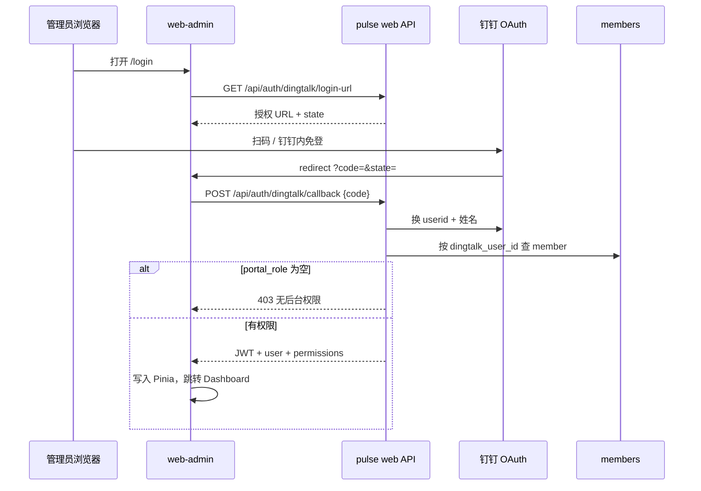

# Web 管理后台 + 统一身份与权限 设计文档

> **版本**：v1（设计稿）  
> **日期**：2026-06-27  
> **状态**：已实现 v1.1（Phase 1–4）  
> **关联**：`2026-06-27-digital-employee-memory-design.md`（personamem / 小脉）

---

## 0. 已确认决策

| 项 | 决策 |
|---|---|
| 配置持久化 | `team_settings` 表；`yaml 默认 ← DB 覆盖 ← env 密钥` |
| 敏感数据 | **不脱敏**；须登录且具备权限方可查看 |
| 运维任务 | **不做危险按钮**；通过与小脉 **AI 对话** 触发；按人权限执行 |
| 前端 | **Vue 3 + Vite + Pinia + Vue Router + Element Plus** |
| 人格 | **钉钉与后台同一人格「小脉」**；同一套 MemoryEngine / 守门 / 记忆 |
| 身份 | **与钉钉打通**；权限、聊天、记忆均以 **同一用户** 为锚点 |

---

## 1. 统一身份模型

### 1.1 核心原则

**一个真人 = 一个 `member` 记录 = 一个钉钉 `dingtalk_user_id`**

- 钉钉私聊/群聊：消息里已有 `sender_staff_id`
- Web 后台：钉钉 OAuth 登录后得到同一 `userid`
- 权限、记忆 `subject_id`、审计日志、AI 任务执行：**全部挂同一 `member.id`**

不再维护独立的「后台账号表」与「钉钉成员表」双轨身份（除非灾备本地账号，见 §1.3）。

### 1.2 `members` 表扩展

在现有 `members` 上增加门户字段：

| 字段 | 类型 | 说明 |
|---|---|---|
| `portal_role` | `null \| owner \| operator \| auditor \| custom` | `null` = 普通成员，不可登录后台 |
| `portal_permissions` | JSON, nullable | `custom` 时显式能力码列表 |
| `password_hash` | str, nullable | 可选；仅灾备本地登录 |
| `last_portal_login_at` | ts, nullable | |

**登录条件**：`portal_role IS NOT NULL` 且 `status = active`。

### 1.3 灾备本地登录（可选）

- 首个 `owner` 可通过 CLI `pulse admin bootstrap` 创建（绑定 dingtalk_user_id + 临时密码）
- 主路径仍是 **钉钉扫码/免登**；本地密码仅钉钉不可用时的 break-glass
- 环境变量 `ADMIN_WEB_TOKEN` 保留为 **机器 API**，与人登录并存

### 1.4 与现有 `admin.dingtalk_user_ids` 的关系

- **迁移**：配置中的 userid 列表 → 对应 `members` 设为 `portal_role=owner`（一次性迁移脚本）
- 之后 owner 在后台「账号与权限」页管理他人角色，**不再依赖**静态 userid 列表做权限（可保留列表仅作「紧急全员管理员」兼容，逐步废弃）

---

## 2. 钉钉 Web 登录

### 2.1 流程



### 2.2 钉钉应用配置

复用现有企业内部应用 `app_key` / `app_secret`，在开放平台补充：

- **重定向 URL**：`https://<admin-host>/login/callback`（开发：`http://localhost:5173/login/callback`）
- 权限：通讯录只读、个人手机号（按需）、**扫码登录**相关 scope

### 2.3 JWT 载荷

```json
{
  "sub": "<member.id>",
  "dingtalk_user_id": "...",
  "display_name": "...",
  "portal_role": "operator",
  "permissions": ["metrics:read", "tasks:nudge", ...]
}
```

Access 2h；Refresh 7d（httpOnly Cookie 或前端安全存储，实现时二选一）。

---

## 3. 权限模型

### 3.1 能力码（与 AI 工具、REST API 共用）

| 能力码 | REST / 页面 | AI 对话可触发示例 |
|---|---|---|
| `settings:read` | 读配置 | 「现在收集截止日是哪天？」 |
| `settings:write` | 改 collection/persona/memory/alerts | 「把每日催办改成 11 点」 |
| `members:read` | 成员列表 | 「谁还没交 CSV？」 |
| `members:write` | 改成员状态 | 「把张三加入催办名单」 |
| `submissions:read` | 提交/待审 | 「有待审截图吗？」 |
| `submissions:review` | 确认/拒绝待审 | 「确认提交 abcd1234」 |
| `metrics:read` | 指标月报 | 「上个月团队总花费多少？」 |
| `metrics:aggregate` | 重新聚合 | 「重新跑一下本月聚合」 |
| `reports:publish` | 发群月报 | 「把月报发到群里」 |
| `memory:read` | 记忆/披露/承诺全文 | 「小王有哪些记忆？」 |
| `memory:write` | 原则/承诺 | 「加一条偏好原则：…」 |
| `evolution:run` | 自进化 | 「跑一轮自我总结」 |
| `tasks:nudge` | 私聊催未提交 | 「催一下没交的人」 |
| `tasks:group_message` | 群消息（非月报） | 「在群里提醒私聊提交」 |
| `audit:read` | 查询/告警/催办日志 | 「最近谁问了 Opus 排名？」 |
| `admin:users` | 管理 portal_role | 「给李四开审计权限」 |

### 3.2 预置角色 → 能力集

- **owner**：全部  
- **operator**：`members:*`, `submissions:*`, `metrics:*`, `tasks:nudge`, `settings:read`, `audit:read`（无 `memory:write` / `reports:publish` / `admin:users`）  
- **auditor**：`*:read` + `memory:read` + `audit:read`  

`custom`：使用 `portal_permissions` JSON。

### 3.3 权限检查点

1. **Vue 路由**：`meta.permission` → 无权限隐藏菜单/跳转 403  
2. **REST API**：`require_permission("metrics:read")` 装饰器  
3. **钉钉 Bot**：`run_command` / 对话路径 → 同一 `PermissionService.check(member, code)`  
4. **Admin Chat API**（Web）：LLM 产出 tool call → 执行前 `check`  
5. **Admin Chat**（钉钉）：同一 `MemoryEngine.reply` + **AdminToolRouter** 挂载到 handler 对话分支

---

## 4. 小脉：双通道同一大脑

### 4.1 共享组件

| 组件 | 钉钉 | Web 后台 |
|---|---|---|
| MemoryEngine | ✓ | ✓ |
| personamem 守门 | ✓ | ✓ |
| 人格 persona | ✓ | ✓ |
| 记忆读写 | ✓ | ✓ |
| 任务工具 | AdminToolRouter | AdminToolRouter |

### 4.2 场景区分（仅影响守门，不影响人格）

| 通道 | VisibilityContext | 说明 |
|---|---|---|
| 钉钉私聊 | `private(audience_id=member.id)` | 现有逻辑 |
| 钉钉群 | `public()` | 现有逻辑 |
| Web Chat | `private(audience_id=当前登录 member.id)` | 视同私聊，可执行管理类 tool |

Web 对话 **不** 把后台管理员操作泄漏到钉钉群；管理动作结果只回显给当前登录者（及审计日志）。

### 4.3 AI 任务执行（无 UI 按钮）

**AdminToolRouter** 注册工具（示例）：

- `nudge_unsubmitted(period?)` → 需 `tasks:nudge`
- `run_aggregate(period)` → 需 `metrics:aggregate`
- `publish_report(period)` → 需 `reports:publish`
- `run_evolution()` → 需 `evolution:run`
- `send_group_tip(message)` → 需 `tasks:group_message`
- `list_pending_reviews()` → 需 `submissions:read`
- `confirm_submission(prefix)` → 需 `submissions:review`

流程：用户自然语言 → LLM 函数调用 → **PermissionGate** → 执行 → 小脉口语化回复 + `admin_audit_log`。

钉钉里管理员私聊小脉说「催一下没交的」→ **同一工具链**，身份来自 `sender_staff_id` 映射的 member。

---

## 5. 配置：`team_settings`

### 5.1 表结构

| 字段 | 说明 |
|---|---|
| `team_id` | FK |
| `section` | `collection` / `persona` / `memory` / … |
| `data` | JSON |
| `updated_at` | |
| `updated_by_member_id` | 审计 |

唯一约束 `(team_id, section)`。

### 5.2 合并规则

```
effective_config = deep_merge(
  config.yaml_defaults,
  team_settings_rows,
  env_overrides_for_secrets_only
)
```

密钥类 **永不** 写入 `team_settings`。

### 5.3 生效

| 变更 | 生效 |
|---|---|
| persona / memory | 下次对话 |
| collection 调度 | 重载 APScheduler |
| 钉钉 app_secret | 需重启（仅 env） |

---

## 6. Web 前端（Vue 3 + Element Plus）

### 6.1 工程

```
web-admin/
  package.json
  vite.config.ts          # proxy /api → pulse web
  src/
    main.ts
    router/index.ts       # 权限 meta
    stores/auth.ts
    stores/settings.ts
    api/                  # axios + JWT 拦截器
    layouts/AdminLayout.vue
    components/ChatPanel.vue   # 全局小脉对话窗
    views/
      Login.vue
      LoginCallback.vue
      Dashboard.vue
      Members.vue
      Submissions.vue
      Metrics.vue
      Memory.vue
      Principles.vue
      Disclosure.vue
      Evolution.vue
      Settings.vue
      Users.vue             # portal_role 管理
      Integrations.vue
```

### 6.2 路由与权限

见需求梳理；无权限菜单项不渲染，`v-if="auth.can('memory:read')"`。

### 6.3 构建与部署

- 开发：`npm run dev`（5173）+ `pulse web`（8080）  
- 生产：`npm run build` → `pulse/web/static/` 由 FastAPI `StaticFiles` 挂载，或 nginx 同域反代  

---

## 7. 后端 API 概要

### 7.1 认证

| 方法 | 路径 | 说明 |
|---|---|---|
| GET | `/api/auth/dingtalk/login-url` | 生成 OAuth URL |
| POST | `/api/auth/dingtalk/callback` | code → JWT |
| POST | `/api/auth/login` | 可选本地密码登录 |
| POST | `/api/auth/refresh` | 刷新 token |
| GET | `/api/auth/me` | 当前用户 + permissions |
| POST | `/api/auth/logout` | |

### 7.2 配置

| 方法 | 路径 | 权限 |
|---|---|---|
| GET | `/api/settings` | `settings:read` |
| PATCH | `/api/settings/{section}` | `settings:write` |

### 7.3 业务观测（JWT + 能力码）

迁移现有 `/api/members`、`/api/periods/*`、`/api/query-logs` 等，并新增 memory 相关只读 API。

### 7.4 对话

| 方法 | 路径 | 说明 |
|---|---|---|
| POST | `/api/chat` | `{ "message": "..." }` → 小脉回复 + 可选 `actions[]` |

钉钉侧不走 HTTP chat，走 Stream handler 同一 **ChatService**。

### 7.5 审计

| 方法 | 路径 | 权限 |
|---|---|---|
| GET | `/api/audit-logs` | `audit:read` |

表 `admin_audit_log`：`member_id`, `channel` (web/dingtalk), `action`, `capability`, `detail`, `created_at`。

---

## 8. 观测页面（登录 + 权限后全文）

| 页面 | 权限 |
|---|---|
| 总览 | 登录即可 |
| 成员 | `members:read` |
| 提交/待审 | `submissions:read` |
| 指标月报 | `metrics:read` |
| 查询/告警/催办 | `audit:read` |
| 记忆/原则/披露/进化 | `memory:read`（**全文，不脱敏**） |
| 业务配置 | `settings:read` / `write` |
| 账号权限 | `admin:users` |
| 集成状态 | `settings:read` |

---

## 9. 实施阶段

### Phase 1 — 身份与壳

- [x] `members` 扩展 + 迁移 `dingtalk_user_ids` → owner  
- [x] `team_settings` + `effective_config` 合并  
- [x] 钉钉 OAuth + JWT  
- [x] `PermissionService`  
- [x] Vue：登录、Layout、路由守卫、Dashboard、成员、提交进度、指标（迁移现有 API）  

### Phase 2 — 数字员工观测 + 配置表单

- [x] Memory / 原则 / 披露 / 进化 API + 页面  
- [x] Settings 各 section 表单  

### Phase 3 — 统一 AI 任务

- [x] `AdminToolRouter` + `admin_audit_log`  
- [x] Web `ChatPanel` → `/api/chat`  
- [x] 钉钉 handler 对话分支接入同一 ChatService（管理员 tool 可用）  

### Phase 4 — 账号管理与打磨

- [x] Users 页管理 `portal_role`  
- [x] Dashboard 图表、调度状态、集成状态页  

---

## 10. 成功标准

1. 同一钉钉账号在 **Web 登录** 与 **私聊小脉** 被识别为同一 `member`，记忆连续。  
2. 无 `tasks:nudge` 权限的用户在 Web 或钉钉让小脉催办，均被拒绝且语气自然。  
3. 有权限用户仅通过 **对话** 即可催办/聚合/发月报，全程可审计。  
4. Web 可改 `collection` / `persona` / `memory` 等写入 `team_settings` 并生效。  
5. Vue 后台可完成运营观测全流程，敏感页必须登录。
