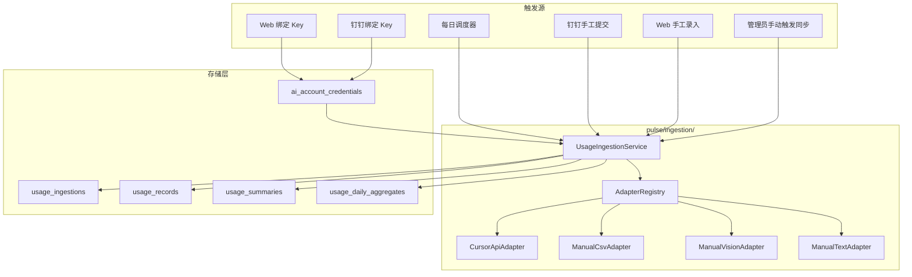

# Cursor API 自动同步 + 统一用量摄取架构 设计文档

> **版本**：v1（设计稿）  
> **日期**：2026-07-09  
> **状态**：待实现  
> **关联**：`docs/PRD-v2-ai-tool-center.md`、`cursor-usage-api.md`  
> **替代**：v2 PRD §6.2 中 Cursor「CSV 导出为主路径」的提交方式

---

## 0. 已确认决策

| 项 | 决策 |
|---|---|
| 数据源 | Cursor **完全弃用 CSV 上传**；通过 User API Key 自动拉取 |
| 数据粒度 | `GetFilteredUsageEvents` 逐条事件 → 本地按天/模型聚合 |
| Key 绑定渠道 | **Web 台账页 + 钉钉私聊** 双通道 |
| 同步频率 | **每日一次**（凌晨定时） |
| 首次回溯 | 绑定后仅拉取**当前计费周期** |
| 改造范围 | **仅 Cursor 自动同步**；智谱/MiniMax/Codex 等保留手工提交 |
| 扩展性 | 统一 `UsageIngestionService` + `IngestionAdapter` 协议，未来厂商可插拔接入 |
| 兼容性 | **无需兼容**；系统未上线，可自由重构数据模型与代码 |

---

## 1. 背景与动机

### 1.1 发现

每个 Cursor 主账号持有者可提供 User API Key（`crsr_...`），通过 `api2.cursor.sh` 非官方接口即可永久自动获取用量数据：

| 接口 | 用途 |
|------|------|
| `POST /auth/exchange_user_api_key` | API Key → session token |
| `GetCurrentPeriodUsage` | 当前计费周期汇总（额度比例） |
| `GetFilteredUsageEvents` | 逐条事件明细（分页 + 时间过滤） |
| `GetAggregatedUsageEvents` | 按模型区间汇总 |
| `GetPlanInfo` | 套餐名称与额度 |

详见仓库内 `cursor-usage-api.md`。

### 1.2 范式转变

| | 旧流程 | 新流程 |
|---|--------|--------|
| 用户操作 | 每月上传 CSV/截图 | 一次性绑定 API Key |
| 数据获取 | 人工触发 | 每日自动同步 |
| 催办对象 | 「请提交用量」 | 「请绑定 Key」/「同步失败请检查」 |
| 审计 | 原始 CSV 文件 | API JSON 快照 + 逐条 events |

### 1.3 设计铁律（继承 PRD v2）

- **计算交给代码，理解交给 AI** — 统计数字由确定性聚合产生
- **各厂家原始货币统计，不做跨币种折算**
- Cursor 走 API；其他厂商暂保留手工，但共用同一摄取管道

---

## 2. 统一摄取架构（方案 C）

### 2.1 核心理念

所有用量数据——无论 API 自动拉取还是手工提交——走同一条管道：

```
触发源 → IngestionAdapter → UsageIngestionService → usage_records → usage_summary
```

`Submission` 概念废弃，替换为 `UsageIngestion`（摄取记录），作为统一的「数据批次」元数据。

### 2.2 架构图



### 2.3 模块结构

```
pulse/ingestion/
├── __init__.py
├── protocols.py        # IngestionAdapter Protocol
├── types.py            # IngestionContext, UsageEventDTO, IngestionResult
├── service.py          # UsageIngestionService（唯一写入入口）
├── registry.py         # 按 vendor + source_type 路由 adapter
├── credentials.py      # 凭证加密/绑定/验证/撤销
└── adapters/
    ├── cursor_api.py   # Cursor API 自动同步
    ├── manual_csv.py   # CSV/XLSX（仅非 Cursor 厂商）
    ├── manual_vision.py # 截图 OCR
    └── manual_text.py  # 文本手工录入

pulse/integrations/
└── cursor_api.py       # HTTP 客户端：Key 兑换、三个 Dashboard 接口
```

### 2.4 Adapter 协议

```python
class IngestionAdapter(Protocol):
    vendor_slug: str | None       # None = 通用手工 adapter
    source_type: str              # "api_sync" | "manual_csv" | "manual_vision" | "manual_text"

    def can_handle(self, context: IngestionContext) -> bool: ...
    def extract_events(self, context: IngestionContext) -> list[UsageEventDTO]: ...
    def extract_metadata(self, context: IngestionContext) -> dict: ...
    def requires_review(self) -> bool: ...  # API=false, 截图=true
```

### 2.5 UsageIngestionService 职责（单一写入入口）

1. 通过 `AdapterRegistry` 选择 adapter → 提取 events
2. 创建 `usage_ingestions` 记录
3. 按 `external_id` / `source_row_hash` 去重写入 `usage_records`
4. 同账号同账期：以最新 confirmed ingestion 为准（覆盖旧 records）
5. 调用现有 `build_account_usage_summary()` 重算 `usage_summaries`
6. 重算 `usage_daily_aggregates`（按天 + 模型）
7. 更新凭证的 `last_sync_at` / `last_sync_status`（API 路径）

---

## 3. 数据模型

### 3.1 废弃与替换

| 旧 | 新 | 说明 |
|----|-----|------|
| `submissions` 表 | `usage_ingestions` 表 | 统一摄取批次 |
| `submission_id` 外键 | `ingestion_id` | `usage_records`、`usage_summaries` |
| `usage_submit_methods: ["csv_export"]` | `["api_key"]` | Cursor plan 种子数据 |
| `pending_submissions` | Cursor: `pending_credential_binds`；手工: 保留 pending ingestion | |
| `submission_status` 模块 | `ingestion_status` 模块 | 上报状态看板 |
| `Submission` ORM | `UsageIngestion` ORM | 全面替换引用 |

### 3.2 `usage_ingestions`

| 字段 | 类型 | 说明 |
|------|------|------|
| id | UUID | PK |
| account_id | FK → ai_accounts | |
| member_id | FK → members, nullable | 触发人；调度器触发时为 null |
| vendor_id | FK → ai_vendors | |
| billing_period | string(7) | YYYY-MM |
| source_type | string | `api_sync` / `manual_csv` / `manual_vision` / `manual_text` |
| channel | string | `scheduler` / `web` / `dingtalk` / `cli` |
| status | string | `confirmed` / `pending_review` / `failed` |
| triggered_by | string | `system` 或 member_id |
| event_count | int | 写入事件数 |
| raw_snapshot_path | string, nullable | API JSON 快照或原始文件路径 |
| metadata_json | JSON | 周期汇总、API 响应摘要等 |
| error_message | text, nullable | 失败原因 |
| ingested_at | datetime | |
| confirmed_at | datetime, nullable | |

### 3.3 `ai_account_credentials`

| 字段 | 类型 | 说明 |
|------|------|------|
| id | UUID | PK |
| account_id | FK → ai_accounts, **unique** | 一账号一凭证 |
| vendor_id | FK → ai_vendors | |
| credential_type | string | `cursor_api_key`（未来：`zhipu_api_key` 等） |
| encrypted_value | text | AES-256-GCM 加密后的 Key |
| key_hint | string(8) | 脱敏展示，如 `crsr_...abc` |
| status | string | `active` / `invalid` / `revoked` |
| bound_by_member_id | FK → members | |
| bound_at | datetime | |
| last_validated_at | datetime, nullable | |
| last_sync_at | datetime, nullable | |
| last_sync_status | string | `success` / `failed` / `never` |
| last_sync_error | text, nullable | |
| sync_enabled | bool, default true | |

### 3.4 `usage_daily_aggregates`

满足「按天分组、看每个模型用量」的 Dashboard 查询需求。

| 字段 | 类型 | 说明 |
|------|------|------|
| account_id | FK → ai_accounts | |
| event_date | date | |
| model | string | |
| event_count | int | |
| total_cost_usd | numeric | |
| tokens_input | int | |
| tokens_output | int | |
| tokens_cache_read | int | |
| updated_at | datetime | |

**唯一约束**：`(account_id, event_date, model)`

### 3.5 `usage_records` 调整

- `submission_id` → `ingestion_id`
- 新增 `external_id`：API 事件 `conversationId` + `timestamp` 哈希，用于跨次同步去重
- 保留现有 token/cost/model/kind 字段

**API 事件字段映射**：

| API 字段 | usage_records 字段 |
|----------|-------------------|
| `timestamp` | `event_at`, `event_date` |
| `model` | `model` |
| `kind` | `kind` |
| `tokenUsage.inputTokens` 等 | `tokens_*` |
| `chargedCents` / `tokenUsage.totalCents` | `cost_usd`（美分 ÷ 100） |
| hash(timestamp, model, conversationId) | `external_id` |

### 3.6 `usage_summaries` 调整

- `submission_id` → `latest_ingestion_id`
- 新增 `sync_source`：`api` / `manual`
- 新增 `last_synced_at`

---

## 4. 核心流程

### 4.1 Cursor API Key 绑定

#### Web 路径

1. 主使用人在台账页 → 账号详情 →「绑定 API Key」
2. 输入 `crsr_...` → `CredentialService.bind()`
3. AES 加密存储 → `CursorApiAdapter.validate()` 验证 Key 有效
4. 验证通过 → 立即触发首次同步（当前计费周期）
5. 返回绑定成功 + 当前额度使用率

#### 钉钉路径

1. 用户私聊发送：`绑定 cursor key crsr_...` 或 `绑定 cursor <账号邮箱> crsr_...`
2. Bot 解析 → 匹配账号 → 验证 + 存储
3. 回复脱敏确认：`已绑定 Cursor 账号 xxx@c.com（crsr_...abc），正在同步用量...`
4. 完整 Key **不**在消息中回显

#### 解绑

- Web / 钉钉均支持「解绑 API Key」
- `status=revoked`，`encrypted_value` 清零，停止同步

### 4.2 每日自动同步

```
每日 02:00 (Asia/Shanghai):
  FOR each credential WHERE status=active AND sync_enabled:
    account = credential.account
    adapter = CursorApiAdapter

    IF credential.last_sync_at IS NULL:
      # 首次：当前计费周期
      summary = GetCurrentPeriodUsage()
      range = [summary.billingCycleStart, now]
    ELSE:
      range = [credential.last_sync_at, now]  # 增量

    events = paginate(GetFilteredUsageEvents, range)
    period_summary = GetCurrentPeriodUsage()

    UsageIngestionService.ingest(
      source_type="api_sync",
      channel="scheduler",
      status="confirmed",       # API 数据自动确认
      events=events,
      metadata=period_summary,
    )

    重算 usage_daily_aggregates(account, affected_dates)
    credential.last_sync_at = now
    credential.last_sync_status = success
```

**原子性**：任一分页失败 → 整次同步标记 `failed`，不写入半拉子数据。

### 4.3 手工厂商流程（智谱 / MiniMax / Codex）

```
用户发截图/文本/CSV
  → ManualVisionAdapter / ManualTextAdapter / ManualCsvAdapter
  → requires_review() = true（截图/低置信度）
  → status = pending_review
  → 管理员 Web 或 Bot 确认 → confirmed
  → UsageIngestionService 重算 summary
```

### 4.4 Cursor 文件上传拦截

钉钉 Bot 收到文件时：

- 若匹配 **Cursor 账号** → 回复引导绑定 API Key，**不**解析 CSV
- 若匹配 **非 Cursor 厂商** → 继续走 `ManualCsvAdapter`

---

## 5. 催办与状态看板

### 5.1 催办逻辑

```python
FOR each active Cursor account:
  IF no credential OR credential.status != active:
    NOTIFY primary_member "请绑定 Cursor API Key"
  ELIF credential.last_sync_status == failed:
    NOTIFY primary_member "用量同步失败，请检查 API Key 是否有效"
  ELIF credential.last_sync_at < now - 36h:
    NOTIFY admin "账号 {id} 同步滞后超过 36 小时"
  ELSE:
    SKIP  # 已自动同步

FOR each active non-Cursor account:
  IF 本月无 confirmed ingestion:
    NOTIFY primary_member 手工提交（现有逻辑）
```

共同使用人 **不催办**（继承 PRD v2）。

### 5.2 状态看板字段

| ingestion_status | 含义 | 适用 |
|------------------|------|------|
| `no_credential` | 未绑定 API Key | Cursor |
| `sync_failed` | 最近同步失败 | Cursor |
| `synced` | 已自动同步且数据新鲜 | Cursor |
| `manual_pending` | 手工提交待审核 | 非 Cursor |
| `manual_submitted` | 手工已确认 | 非 Cursor |
| `unsubmitted` | 本月无数据 | 非 Cursor |

### 5.3 Plan 配置

Cursor plans：`usage_submit_methods = ["api_key"]`

其他 plans：保持 `["screenshot", "manual"]` 或 `["screenshot", "manual_text"]`

---

## 6. API 与前端变更

### 6.1 新增 API

| 端点 | 说明 |
|------|------|
| `POST /api/v2/accounts/{id}/credentials` | 绑定 API Key |
| `DELETE /api/v2/accounts/{id}/credentials` | 解绑 |
| `GET /api/v2/accounts/{id}/credentials` | 查看绑定状态（脱敏） |
| `POST /api/v2/accounts/{id}/sync` | 管理员手动触发同步 |
| `GET /api/v2/accounts/{id}/usage/daily` | 按天/模型聚合查询 |
| `GET /api/v2/ingestions` | 摄取记录列表（替代 submissions） |
| `POST /api/v2/ingestions/{id}/confirm` | 审核确认（手工厂商） |
| `POST /api/v2/ingestions/{id}/reject` | 审核拒绝 |

### 6.2 废弃 API

| 端点 | 动作 |
|------|------|
| `GET/POST /api/v2/submissions/*` | 替换为 ingestions |
| `GET /api/v2/submission-status` | 替换为 ingestion-status |

### 6.3 Web Admin 变更

| 页面 | 动作 |
|------|------|
| `AccountsView.vue` | 新增 API Key 绑定/解绑 UI、同步状态、手动同步按钮 |
| `SubmissionsView.vue` | 重命名为 `IngestionsView.vue` |
| `PendingApprovalView.vue` | 仅展示手工厂商待审核 |
| 新增用量图表 | 按天/模型折线图（查 `usage_daily_aggregates`） |

### 6.4 钉钉 Bot 变更

| 指令/行为 | 动作 |
|-----------|------|
| `绑定 cursor ...` | 新增 Key 绑定 |
| `解绑 cursor ...` | 新增 Key 解绑 |
| 发送 CSV（Cursor 账号） | 引导绑定 Key |
| `/待审` | 改为 `/待审 ingestion`（仅手工） |
| 催办文案 | Cursor 改为 Key 绑定/同步失败 |

---

## 7. 安全

| 项 | 措施 |
|----|------|
| 加密算法 | AES-256-GCM |
| 加密密钥 | 环境变量 `PULSE_CREDENTIAL_ENCRYPTION_KEY`（32 字节） |
| 存储 | 仅 `encrypted_value` + `key_hint`（末 4 位） |
| 展示 | Web/钉钉仅显示 `crsr_...abc` |
| 权限 | 绑定/解绑：主使用人或 admin；查看状态：主使用人、admin |
| 日志 | 任何日志/审计中 Key 必须脱敏 |
| Token | 每次同步用 API Key 重新 exchange，**不持久化** accessToken |

---

## 8. 错误处理

| 场景 | 处理 |
|------|------|
| Key 无效 (401) | `credential.status=invalid`，私聊通知主使用人重新绑定 |
| API 限流 (429) | 指数退避重试 3 次，仍失败 → `sync_failed` |
| API 结构变更 | adapter 解析失败 → `sync_failed` + 告警管理员 |
| 部分分页失败 | 整次同步 failed，不写入半拉子数据 |
| 非官方 API 下线 | 告警 + 降级提示；手工厂商不受影响 |

---

## 9. 需删除/重构的模块

| 模块 | 动作 |
|------|------|
| `pulse/storage/models.py` `Submission` | 替换为 `UsageIngestion` |
| `pulse/channels/pending_submission.py` | Cursor 部分 → `pending_credential_bind` |
| `pulse/channels/dingtalk/handler.py` Cursor CSV 分支 | 删除，改为 Key 绑定引导 |
| `pulse/tool_center/submission_status.py` | 重命名为 `ingestion_status.py` |
| `pulse/storage/repository.py` submission 方法 | 迁移到 `pulse/ingestion/service.py` |
| `pulse/extract/csv_parser.py` | **保留**（非 Cursor 厂商） |
| `pulse/tool_center/seed.py` Cursor plans | `usage_submit_methods=["api_key"]` |
| `web-admin/SubmissionsView.vue` | → `IngestionsView.vue` |
| `tests/test_*submission*` | 重写为 ingestion 测试 |

---

## 10. 测试策略

| 层级 | 覆盖 |
|------|------|
| 单元 | `CursorApiClient` mock HTTP；事件字段映射；凭证加解密 round-trip |
| 集成 | `UsageIngestionService` 全链路：adapter → records → summary → daily_agg |
| 催办 | Cursor: no_credential / sync_failed / synced；非 Cursor: unsubmitted |
| Bot | 绑定/解绑指令解析；Cursor CSV 拦截引导 |
| Web | credentials API；ingestion 审核流 |

---

## 11. 未来扩展

新厂商接入 API 时：

1. 在 `ai_plans.usage_submit_methods` 增加对应 method（如 `zhipu_api_key`）
2. 实现 `IngestionAdapter` 子类 + `CredentialService` 验证逻辑
3. 注册到 `AdapterRegistry`
4. 调度器按 `credential_type` 路由

**无需改动** `UsageIngestionService`、`usage_records`、`usage_summaries` 核心逻辑。

---

## 12. 参考

- `cursor-usage-api.md` — Cursor 非官方 API 完整参考
- `cursor-usage.sh` — 周期汇总脚本（可复用 HTTP 逻辑到 `pulse/integrations/cursor_api.py`）
- `docs/PRD-v2-ai-tool-center.md` — 产品需求基线
