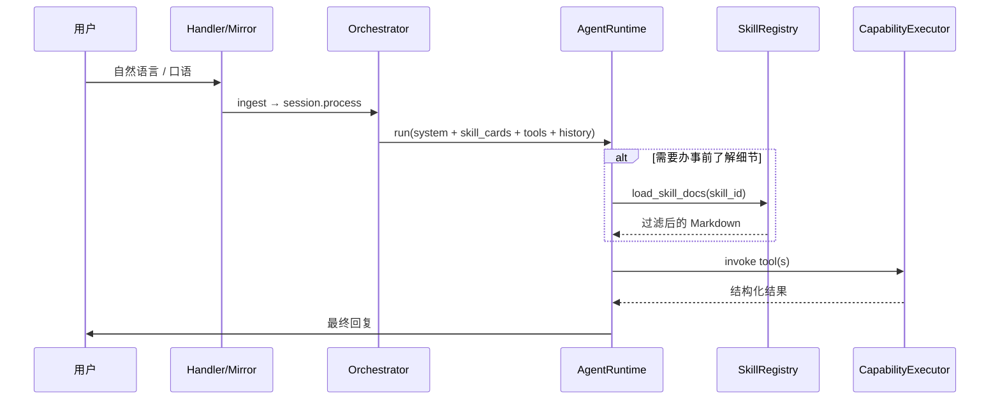

# 钉钉交互：Skills（技能）与 Tools（能力）分层设计

**日期：** 2026-07-20  
**状态：** Phase A/B/C 已落地 — `run_command` 已删除；capability 路由 metrics 已上线；借 Key/审批 handler 已参数化  
**范围：** 钉钉/Web 文本对话路径；Assistant AgentRuntime；现有 Capability 执行链保留  
**前置：** [2026-07-16-dingtalk-llm-agent-tools-design.md](./2026-07-16-dingtalk-llm-agent-tools-design.md)（Agent + Tools 已落地）

> **注（2026-07-21）：** 本文中「`catalog.yaml` 服务域卡片」「一服务域一 Skill」的模型已被 [2026-07-21-file-as-skill-vector-routing-design.md](./2026-07-21-file-as-skill-vector-routing-design.md) 取代——`catalog.yaml` 已删除，改为**每个 Markdown 文件即一个 Skill**（frontmatter 名片），每轮按向量语义检索注入命中名片（0 命中不注入）。本文档保留作为 Skill/Tool 分层与 Capability 迁移的历史背景，涉及卡片来源/服务域分组的表述请以新设计为准。

## 1. 背景与问题

当前对话路径已是 **LLM Agent + Capability Tools**，但用户侧「服务」与执行侧「接口」仍混在同一层：

| 现状 | 问题 |
|------|------|
| `help.py` 维护 `_HELP_COMMANDS`（语法、详情、capability_keys） | 命令文档与 Agent tools 双轨；help 按 capability 过滤，非按「服务」组织 |
| `agent_policy` 注入扁平 capability 短目录 | 模型首轮上下文被 tool 名淹没，缺少「何时用哪项服务」的场景叙事 |
| `run_command` / `channel_command` 仍承接部分 text | 口令与 tool 参数两套入口，长期漂移 |
| `bot.help` capability | 与 Agent 策略（不下发 help tool）冲突 |

产品目标：**用户侧以 Skill（技能）呈现服务**；模型先看技能卡片（元数据 + 使用场景），按需拉取详情；**Tool 仍是 Capability + invoke**，与 Skill **无系统级绑定关系**。

## 2. 目标与非目标

### 2.1 目标

1. **Skill 卡片**：每轮 system 注入当前用户可见的技能卡片列表（约 5–8 张，按服务域分组；仅元数据，不含长文档）。
2. **渐进披露**：模型通过元工具 `load_skill_docs(skill_id, section?)` 按需加载 Markdown 详情。
3. **Tool 独立**：授权 Capability 仍映射为 function tools；Skill 文档内 **以自然语言提及 tool 名**（如 `quota_self_read`），由模型自行调用；**不**维护 skill↔tool 注册表或外键。
4. **权限分层**：
   - **能否执行** → Tool 层（现有 `resolve_capabilities` + invoke 鉴权）。
   - **能否看到某项服务** → Skill 卡片 `audience` 过滤。
   - **同一服务的信息密度** → Skill 文档分节 `audience` 过滤（普通成员 / 主管 / 管理员）。
5. **命令迁移**：现有 `_HELP_COMMANDS` 与 `run_command` 口令 **全部** 写入对应 Skill 的 **任务分节**；口令作为文档示例说法，不再作为独立路由层。Skill 按服务域分组，**非** 一命令一技能。

### 2.2 非目标（一期）

- Skill Studio 后台可视化编排（管理后台已提供技能/Prompt **只读预览**，见 [admin-skills-tools-readonly-design](./2026-07-20-admin-skills-tools-readonly-design.md)）
- Skill 与 Tool 的系统级多对多绑定、编排引擎
- 废除 Capability Registry / Pulse Provider（执行面不变）
- 工作群「启动」、引导图、CSV/截图等 **Channel 本地状态机** 改为 Agent 执行（仍本地处理，仅提供 Skill 说明）
- 物理删除 `run_command`（并行收口，迁移完成后 deprecate）

## 3. 核心概念

### 3.1 Skill（技能）— 用户侧服务域

面向模型的 **服务说明书**，描述一类用户可理解的任务域，**可涵盖多组相关的 Tool（Capability）**。  
Skill 不是 Capability 的 1:1 包装，也 **不在系统里登记** skill↔tool 关系。

**划分原则**

- 按 **用户意图 / 业务场景** 分组，而非按 API 或旧命令条目拆分。
- 同一 Skill 文档内用分节（或子标题）覆盖多条相关能力（如「查额度」「绑 Key」「我的用量」同属「我的 Cursor」）。
- 卡片数量宜少（成员约 **5–8 张**，管理员额外 **1–2 张**），避免目录膨胀。
- Tool 仍独立暴露；文档中 ** prose 提及** 可能用到的 tool 名，由模型按任务选用其一或多个。

**卡片（首轮可见，短）**

```yaml
skill_id: cursor.self
name: 我的 Cursor
summary: 查看本人 Cursor 用量、额度与提交记录；绑定或解绑 API Key 以开启自动同步。
when_to_use:
  - 用户问「我的用量」「额度够不够」「有没有提交」
  - 用户要绑定/解绑 Cursor Key
  - 用户发送 crsr_ 开头的 Key（私聊）
audience: [member]
aliases: [cursor, 额度, 我的用量, 绑定]
privacy: private   # Key 相关操作建议私聊
```

**文档（按需加载，长）**

- 路径：`assistant_platform/skills/docs/{skill_id}/`
- 分节文件带 frontmatter，例如：
  - `audience: [member]` — 谁可见本分节
  - `when_to_use:` — **适用场景**（列表）；`load_skill_docs` 时注入正文为「**适用场景**」小节，供模型判断是否命中本分节
  - 例：`overview.md`、`tasks/*.md`、`admin.md`、`manager.md`
  - 正文 **可写**「调用 tool `quota_self_read`」等，平台 **不解析、不校验** 该引用。

### 3.2 Tool（工具）— 可执行接口

- 定义不变：`assistant_platform/capabilities/catalog.py` + Pulse handlers。
- Agent 侧：`tools_from_capabilities(authorized_caps)` → OpenAI function schemas。
- 与 Skill **零耦合**：无 `skill_ids` 字段、无 join 表。

### 3.3 元工具 `load_skill_docs`

| 参数 | 说明 |
|------|------|
| `skill_id` | 技能 ID |
| `section` | 可选：`overview` \| `steps` \| `examples` \| `admin` \| `manager` \| `all`；默认 `overview,steps,examples`（按 audience 过滤后合并） |

- **本地执行**（类似 `notify_user` / memory tools），不经过 Pulse。
- 返回 Markdown；超长按 `recall.context_token_budget` 同类策略截断并标注。
- 若 `skill_id` 对当前 actor 不可见 → 结构化错误。

### 3.4 Audience 模型

| 标签 | 判定（建议） |
|------|----------------|
| `member` | 所有已登录门户成员（`portal_status=active`） |
| `manager` | 存在下属且业务上为主管；审批提示仅在存在待审事项时展示 |
| `admin` | `owner` / `operator` 或 channel admin / `is_channel_admin` |

**卡片过滤：** `SkillRegistry.list_cards(actor)` 只返回 actor 匹配 `audience` 的技能。

**文档过滤：** `load_skill_docs` 只合并 actor 有权阅读的节。

**Tool 过滤：** 仍仅 `resolve_capabilities(team, role, member_id)` — 与 Skill 无关。

**信息密度示例（同一 `skill_id: key.loan`）**

| Actor | 卡片 | 文档节 | 典型 tools（授权子集） |
|-------|------|--------|------------------------|
| 普通成员 | 借 Key | overview, steps, examples | `key_loan_request`, `key_loan_return`, `key_loan_self_read` |
| 管理员 | 借 Key | 上述 + `admin` | 另含 `key_loan_list`, `key_loan_revoke` |

管理员卡片 **不拆** 成 `key.loan.admin` 第二个 skill_id；用文档分节区分密度。

## 4. 对话时序



**Agent 策略补充（`agent_policy.py`）**

1. 先对照 **技能卡片** 的 `when_to_use` 理解用户意图；不确定时 `load_skill_docs`。
2. 执行副作用必须调用 **Tool**；禁止仅口头声称已办理。
3. 文档中提到的 tool 名须与用户 **已授权** tools 交集内；无权限 tool 不可调用，应说明并建议替代路径。
4. 敏感 tool 仍遵循现有 risk / 口头确认约定。
5. **不再** 维护固定口令表；用户说「额度」「借 Key」等由模型结合 Skill 理解。

## 5. 内容存放与注册

### 5.1 目录结构

```
assistant_platform/skills/
  registry.py          # 加载卡片 YAML、解析 docs
  catalog.yaml         # 全部 skill 卡片元数据（约 8–12 条，非 20+）
  docs/
    cursor.self/       # 一组：额度、用量、提交、绑 Key
      overview.md
      tasks/           # 按任务分子文档，非按 capability
        quota.md
        bind-key.md
        usage-detail.md
    key.loan/
      overview.md
      tasks/
        borrow.md
        return.md
      admin.md
    team.admin/
      overview.md
      tasks/
        report.md
        aggregate.md
        ...
```

### 5.2 启动时

- 读取 `catalog.yaml` + docs 文件 hash 缓存（可选 DB 表 `ap_skill_docs` 仅作缓存，非关系绑定）。
- **不** seed skill↔capability 链接。

### 5.3 与 `help.py` 的关系

- **迁移完成后**：`_HELP_COMMANDS` 废弃；`bot.help` capability 改为调用 `SkillRegistry` 渲染（或仅保留 `bot.guide` 元技能文档）。
- 过渡期：help 详情从 Skill docs 生成，保证单一真源。

## 6. 技能目录（分组）与旧命令归位

**原则：** 旧 `_HELP_COMMANDS` / `run_command` 口令 **不再各占一个 skill**，而是写入对应 Skill 文档的 **任务分节**。  
下表「涵盖能力」仅作迁移对照与文档编写索引，**不是**系统注册关系。

### 6.1 成员向技能（约 5 张卡片）

| skill_id | 名称 | 使用场景（when_to_use 摘要） | 文档任务分节（吸收的旧命令/能力） | 文档中可能涉及的 tools（ prose 提及） |
|----------|------|------------------------------|-----------------------------------|--------------------------------------|
| **`cursor.self`** | 我的 Cursor | 查本人用量、额度、提交；绑/解绑 Key | 我的、我的用量、额度、绑定 Key、解绑 Key | `submission_self_read`, `usage_self_read`, `quota_self_read`, `cursor_key_bind`, `cursor_key_unbind` |
| **`key.loan`** | 临时 Key 借用 | 额度不够借 Key、查看/归还借用 | 借 Key、归还 Key、我的借用；（admin 节）借用列表、撤销借用 | `key_loan_request`, `key_loan_return`, `key_loan_self_read`, `key_loan_list`, `key_loan_revoke` |
| **`cursor.onboarding`** | Cursor 账号申请 | 申请团队分配 Cursor 账号；主管审批 | 申请 Cursor；审批 通过/拒绝（manager/admin 节） | `access_request_create`, `access_request_decide` |
| **`usage.other`** | 其他 AI 工具用量 | 上报智谱/MiniMax/Codex；截图识别 | 上报、用量、截图 | `usage_manual_submit` |
| **`knowledge.share`** | 团队技巧分享 | 分享心得、浏览技巧库 | 心得、技巧、技巧库 | `knowledge_tip_create`, `knowledge_tip_list`, `knowledge_tip_read` |
| **`web.research`** | 联网查资料 | 查公开网页、补充搜索摘要 | （原 capability 无独立命令） | `web_search`, `web_fetch` |

### 6.2 管理员向技能（1–2 张卡片）

| skill_id | 名称 | 使用场景 | 文档任务分节 | 可能涉及的 tools |
|----------|------|----------|--------------|------------------|
| **`team.admin`** | 团队运营管理 | 月报、聚合、催办进度、成员、告警、导出、引导图 | 状态、聚合、报告、成员、告警、导出、设置引导图；可选 legacy：待审/确认/拒绝 | `submission_status_read`, `usage_aggregate`, `report_publish`, `members_manage`, `alerts_run`, `usage_export`, `guide_image_update`, `ingestion_*`（遗留） |

管理员 **不** 按「报告 / 聚合 / 告警」拆成 7 个 skill；一张 `team.admin` 卡片 + 文档内任务分节即可。

### 6.3 元技能与 Channel 本地

| skill_id | 名称 | 说明 | tools |
|----------|------|------|-------|
| **`bot.guide`** | 小脉能做什么 | 替代 `bot.help`；索引其它 skill 卡片 | 无 — 引导 `load_skill_docs` |
| **`dingtalk.setup`** | 钉钉工作群 | 群内 @ 发「启动」绑定工作群；**执行仍走 Channel 本地** | 无 — 文档说明操作步骤 |

### 6.4 卡片规模（目标）

| 角色 | 可见 skill 卡片数（约） |
|------|------------------------|
| 普通成员 | 5–6（不含 `team.admin`） |
| 主管 | +0（`cursor.onboarding` 文档含 manager 节；审批提示仅待审时出现） |
| 管理员 | +1（`team.admin`）+ 各 skill 的 admin 文档节 |

### 6.5 与旧 help topic 的对照（迁移用，非 runtime 映射）

| 旧 help topic_id | 归入 skill_id | 文档位置 |
|------------------|---------------|----------|
| my, my_usage, quota, bind, unbind | `cursor.self` | tasks/* |
| borrow, my_loan, return_key, loan_list, revoke_loan | `key.loan` | tasks/* + admin |
| apply, approve | `cursor.onboarding` | tasks/* + manager/admin |
| manual | `usage.other` | tasks/* |
| tip | `knowledge.share` | tasks/* |
| report, status, aggregate, members, alerts, export, guide_image | `team.admin` | tasks/* |
| （无）web | `web.research` | overview + tasks |
| （无）启动 | `dingtalk.setup` | overview |

## 7. 组件改动摘要

| 组件 | 改动 |
|------|------|
| `assistant_platform/skills/` | **新增** registry + catalog.yaml + docs |
| `agent_policy.build_agent_system` | 注入 **Skill 卡片**（非 capability 扁平列表）；策略引用 `load_skill_docs` |
| `agent_tools.py` | 注册 `load_skill_docs`；**移除** capability 短目录重复；tools 仍来自 authorize caps |
| `agent_runtime.py` | 处理 `load_skill_docs` 本地调用 |
| `conversation/help.py` | 改为读 SkillRegistry；`_HELP_COMMANDS` deprecate |
| `capabilities/catalog.py` | `bot.help` → 薄包装或 deprecate；无 skill 字段 |
| `pulse/channels/commands.py` | 逐步改为 capability 专用 handler；最终仅 channel_command 兜底 |
| `docs/bot-commands.md` | 改为「技能说明」索引，指向 Skill docs 源 |

## 8. 迁移阶段

### Phase A — 基础设施（1–2 周）

1. `SkillRegistry` + `catalog.yaml` + 首批 **4 个分组 skill** docs（`cursor.self`, `key.loan`, `bot.guide`, `team.admin` 骨架）
2. `load_skill_docs` 元工具 + agent_policy 卡片注入
3. 单测：audience 过滤、docs 截断、不可见 skill 拒绝

### Phase B — 全量命令写入 Skill 文档（1–2 周）

1. 补全 §6.1–6.3 全部 skill docs（**8 张卡片**，非 20+）
2. 旧 `_HELP_COMMANDS` 正文迁入对应 skill 的 **tasks/** 分节；`help.py` 改为 Skill 驱动
3. 对照 `docs/bot-commands.md` 做内容 diff，确保无遗漏口令

### Phase C — 收口 run_command（已完成）

1. 全部 capability 注册专用 handler（借 Key / 审批等已参数化 JSON）
2. `run_command` 已物理删除；`GET /api/internal/v1/capabilities/routing-metrics` 监控 dedicated / missing_handler

## 9. 成功标准

1. 普通成员首轮 system **只见约 5–6 张**技能卡片，不含管理员运营长文。
2. 用户口语「额度多少」→ 命中 `cursor.self` → `load_skill_docs` → 调用 `quota_self_read`（若授权）。
3. 用户「借 key」→ 命中 `key.loan`（同一 skill 文档含借/还/查/admin 分节）。
4. `help.py` 与 Skill docs **单一真源**；旧 topic 仅作迁移对照表（§6.5）。
5. 现有 bind / loan / quota / portal 相关测试行为不回归。

## 10. 已确认决策

1. **不建 `usage.insights` skill**；复杂用量分析不走独立技能卡片，后续若需要由 Agent 直接调用已授权 tools。
2. **主管审批提示**：`cursor.onboarding` 审批文档对主管可读，但卡片级提示 **仅在有待审下属申请时** 追加（如 summary 末尾「当前有 N 条待审批」）。
3. **遗留待审摄取**：写入 `team.admin` 文档附录，不单独建 skill。

---

**变更记录**

| 日期 | 说明 |
|------|------|
| 2026-07-20 | 初稿：Skill/Tool 解耦、audience 权限、全命令→Skill 映射 |
| 2026-07-20 | 修订：Skill 按用户服务域分组，一 skill 涵盖多能力；旧命令写入文档任务分节 |
| 2026-07-20 | 定稿调整：删除 `usage.insights`；主管审批仅在有待审时提示 |
| 2026-07-20 | Phase A/B 实现：SkillRegistry、8 张卡片、help 迁移、mirror pending 计数 |
| 2026-07-20 | Phase C 收尾：删除 run_command；routing metrics API；access/loan 结构化 handler |
| 2026-07-20 | 文档 frontmatter 增加 `when_to_use`（适用场景）；load 时注入正文 |
